# 基于 FUSE 的文件系统设计与实现

## FUSE 背景与资料

### [fuse-1.3 的工作方式](http://fuse.sourceforge.net/doxygen/index.html#section1)

  
图 1-1, 来源 http://en.wikipedia.org/wiki/File:FUSE_structure.svg  

#### 内核模块

内核模块由两个部分组成, 第一个是位于 `kernel/dev.c` 的 `proc` 文件系统, 第
二个是位于 `kernel/file.c`, `kernel/inode.c`, `kernel/dir.c` 的文件系统
调用.

`kernel/file.c`, `kernel/inode.c`, `kernel/dir.c` 中的所有系统调用都会
调用 `request_send()`, 或者是 `request_send_noreply()`, 又或者是
`request_send_noblock()`. 大多数系统调用 (有2个除外) 调用的是
`request_send()`. `request_send()` 将请求放入 "请求队列" (`fc->pending`),
等待响应. `request_send_noreply()` 不会等待响应, `request_send_noblock()`
不会阻塞, 除此之外, 这两个函数与 `request_send()` 的功能相同.

`proc` 文件系统对应于 `/dev/fuse` 的文件 I/O 请求. `fuse_dev_read()` 处理
文件的读操作, 并将 "请求队列" 的命令返回给主调程序. `fuse_dev_write()`
处理文件的写操作, 该函数接收要被写入的数据, 将其放入 `req->out` 结构中,
这些要被写入的数据会通过 "请求队列" 与 `request_send()` 返回给系统调用.

#### fuse 库函数
* 当你的用户态程序调用 `fuse_main()` (`lib/helper.c`) 时, `fuse_main()` 开始
解析传递给程序的参数, 然后调用 `fuse_mount()` (`lib/mount.c`).
* `fuse_mount()` 创建一对 UNIX 域套接字, 然后 `fork()` 并 `exec()`
`fusermount`
(`util/fusermount.c`), 通过环境变量 `FUSE_COMMFD_ENV` 将其中一个套接字传递
给 `fusermount`.
* `fusermount` (`util/fusermount.c`) 先确定 fuse 模块已加载进内核. 然后,
`fusermount` 打开 `/dev/fuse` 并将文件描述符通过 UNIX 域套接字发回给 
`fuse_mount()`.
* `fuse_mount()` 收到 `/dev/fuse` 的文件描述符后将其返回给 `fuse_main()`.
* `fuse_main()` 调用 `fuse_new()` (`lib/fuse.c`), 后者分配一个结构体
`struct fuse`, 该结构用来存放并维护文件系统数据的一个缓冲映像.
* 最后, `fuse_main()` 或者调用  `fuse_loop()`, 又或者是 `fuse_loop_mt()`
(`lib/fuse.c`), 这两个函数都会从 `/dev/fuse` 中读取用户文件系统从内核收
到的请求 (比如 `read`, `stat` 等), 然后调用 `struct fuse_operations` 中对应
的用户态函数, 函数调用的结果会写回到 `/dev/fuse`, 通过它返回给内核.

### [fuse 文件系统简介](http://lxr.free-electrons.com/source/Documentation/filesystems/fuse.txt)

#### 定义

* 用户空间文件系统  
一种文件系统, 它的数据与元数据由一个普通的用户态进程提供. 该文件系统可以
通过内核接口 (系统调用) 访问.

* 文件系统守护进程  
提供文件系统的数据与元数据的进程

* 非特权挂载 (或 用户挂载)  
一个被非特权用户 (非 root 用户) 挂载的用户空间文件系统. 文件系统守护进程的
特权级是执行挂载操作的用户的特权级. **注意**: 这与 `/etc/fstab` 的 `user`
选项不同, 该选项允许一个普通用户挂载文件系统, 在这里我们不讨论
`/etc/fstab`.

* 挂载属主  
执行挂载操作的用户.

* 用户  
执行文件系统操作的用户.

#### 什么是 FUSE?

FUSE 是一个用户空间文件系统框架. 它由一个内核模块 (`fuse.ko`), 用户空间 
库函数 (`libfuse.*`), 一个挂载实用程序 (`fusermount`) 组成.

FUSE 一个最重要的特点是允许安全的非特权挂载. 这个特点开启了文件系统
的一个新的用法. 一个好的例子是 sshfs: 一个安全的, 使用 sftp 协议的网络
文件系统.

用户空间的库函数与实用程序可以从 FUSE 的首页获取 http://fuse.sourceforge.net

#### 文件系统类型

传递给 `mount`(2) 的文件系统类型参数可以是以下两种:
* `fuse`  
这是挂载 FUSE  文件系统的通常方式. 传递给 `mount` 系统调用的第一个参数可
以是任意的字符串, 内核不会对该字符串进行解释.
* `fuseblk`  
文件系统是基于块设备的. 传递给 `mount` 系统调用的第一个参数被内核解释
成设备名.

#### 挂载参数
* `fd=N`  
用于用户空间文件系统与内核之间通信的文件描述符, 该文件描述符必须事先通过
打开 `/dev/fuse` 获取.

* `rootmode=M`  
文件系统根目录的访问权限, 以 8 进制表示.

* `user_id=N`  
挂载属主的用户 ID.

* `group_id=N`  
挂载属主的组 ID.

* `default_permissions`   
FUSE 默认不会检查文件访问权限, 文件系统可以自由地实现自身的访问策略, 或者 
将工作交给底层的文件访问机制 (例如, 网络文件系统). 这个选项开启权限检查,
根据文件的访问权限设置来限制用户的访问. 这个选项通常与 `allow_other` 选项 
配合使用.

* `allow_other`  
这个选项解除了 "只有挂载文件系统的用户才有权利访问文件" 的限制. 默认该
选项只对 root 开放, 但这个限制可以通过 (用户空间的) 配置文件来移除.

* `max_read=N`  
`read` 操作一次所能读取的最大字节数, 默认值是无限制. **注意**, 无论如何,
`read` 请求的大小最多被限制为 32 页 (在 i386 架构中是 128 字节).

* `blksize=N`  
设置文件系统的块大小. 默认值是 512. 这个选项只对 `fuseblk` 类型的文件
系统有效.

#### 控制文件系统

这里有一个 FUSE 的控制文件系统, 可以通过下面这个命令挂载:

	mount -t fusectl none /sys/fs/fuse/connections

将它挂载到 `/sys/fs/fuse/connections` 是为了向下兼容.

在控制文件系统中, 每一个连接都对应有一个目录, 目录用互不相同的数字命名.

对每一个连接, 它对应的目录中都至少存在这两个文件:

* `waiting`  
等待被传送到用户空间, 或等待被文件系统守护进程处理的请求个数. 如果文件
系统没有活动在进行, 而 `waiting` 的内容不为零, 那么肯定是文件系统被挂
起, 或者是发生了死锁.

* `abort`  
往这个文件写任何数据都会终止文件系统连接, 此时等待中的请求都会被终止并返回
一个错误, 新请求也会如此.

只有挂载属主才会写或读这些文件.

#### 中断文件系统操作

如果一个正在发送 FUSE 文件系统请求的进程被某个信号中断了, 会发生下面几件事:

1. 如果请求还未被发送至用户空间**并且**信号是致命的 (`SIGKILL`, 或者是未捕
捉的致命信号), 那么请求就会被移出队列, 并马上返回.
2. 如果请求还未被发送至用户空间**并且**信号是非致命的, 那么就会为该请求设置
一个 `interrupted` 标记. 当请求成功传送到用户空间, 并且这个标记被设置, 一
个 `INTERRUPT` 请求会被排入队列.
3. 如果请求已经被传送至用户空间, 那么一个 `INTERRUPT` 请求会被排入队列.

`INTERRUPT` 请求优先于其他请求, 所以用户空间文件系统会优先接收已排队的
`INTERRUPT` 请求.

用户空间文件系统可以完全忽略 `INTERRUPT` 请求, 也可以向请求的 _来源_ 发送
一个回复来提醒它发生了一个中断, 并将 `errno` 设置为 `EINTR`.

在处理原始请求与 `INTERRUPT` 之间可能存在竞争状态, 这时候有两种可能:

1. `INTERRUPT` 请求在原始请求之前被处理.
2. `INTERRUPT` 请求在原始请求得到响应之后被处理.

如果文件系统无法找到原始请求, 它应该等待一定的时间, 和 (或) 等待一定数量
的新请求到来, 在这之后, 它应该向 `INTERRUPT` 请求返回 `EAGAIN` 错误. 在第 
1 种情况 (指上面提到的两种可能的竞争状态中的第1种) 中, `INTERRUPT` 请求会被 
重新排队, 在第 2 种情况下, `INTERRUPT` 
的回复会被忽略.

#### 中断一个文件系统连接
文件系统无法响应是有可能的. 可能的原因包括:

1. 有缺陷的用户空间文件系统实现.
2. 网络连接断开.
3. 偶然性的死锁.
4. 恶意的死锁.

(关于第 3 点与第 4 点更多的信息请看后面的小节)

在任何一种情况下, 中断文件系统连接都是一种比较好的解决方案. 中断连接有下
面几种方案:

* 杀死文件系统守护进程, 对第 1 种与第2 种情况有效.
* 杀死文件系统守护进程与所有的文件系统用户. 对所有情况有效, 除了某些恶意
的死锁.
* 强制卸载 (`umount -f`). 对所有情况有效, 但前提是文件系统仍然处于挂接
状态 (未被懒惰卸载).
* 通过 FUSE 控制文件系统 终止. 这是最有效的方案, 总能奏效.

#### 非特权挂载如何起作用

因为 `mount()` 系统调用是一个特权操作, 所以需要 `fusermount` 的帮助,
`fusermount` 的 SUID 为 root.

提供非特权挂载的目的是防止挂载属主利用该能力来危害系统. 为了做到这一点,
下面这些需求是显然的:

1. 挂载属主不能在被挂载文件系统的帮助下, 提升自己的权限.
2. 挂载属主不能非法获取其他用户或超级用户的进程信息.
3. 挂载属主不能向其他用户或超级用户的进程施加未期望的行为.

#### 如何满足需求?

* A) 挂载属主可以通过下面2种方式之一提升权限:  

  + 1) 创建一个包含设备文件的文件系统, 然后打开该设备文件.  
  + 2) 创建一个包含 SUID 或 SGID 程序的文件系统, 然后运行该程序.  

解决方案是禁止打开设备文件, 在执行程序时忽略 SGID 与 SUID.
为了达到这两个 目的, 对于非特权挂载, `fusermount` 总是为 `mount`
设置添加 `nosuid` 与 `nodev` 这两个选项.

* B) 如果有另外一个用户正在访问文件系统的文件或目录, 此时, 为请求提供服务的
文件系统守护进程会记录下操作的执行顺序与时间. 这些信息对挂载属主来说是不
可访问的, 所以如果挂载属主知晓了其他用户的操作信息, 这种现象叫做
**信息泄漏**.

这个问题的解决方案在在 C) 的 2) 中介绍.

* C) 挂载属主可以用多种方式向其他用户进程施加未期望的行为, 例如:

  + 1) 在一个文件或目录之上挂载文件系统, 而这个文件或目录对挂载属主来说
  是不可修改的 (或者只能做非常有限的修改).  
这一点可以用 `fusermount` 解决. `fusermount` 检查挂载点的访问权限, 只
有在挂载属主有权利对挂载点作无限制的修改 (对挂载点拥有写权限, 挂载点没有
设置粘置位) 的前提下, 才允许挂载.

  + 2) 即使情况 1) 被解决了, 挂载属主依然有能力改变其他用户进程的行为:

    - i) 通过发起一个针对用户或整个系统的 DoS (拒绝服务攻击),
    挂载属主可以减慢或无限期地推迟一个文件系统操作. 一个设置了 SUID
    的程序锁住了一个系统文件,
    然后该程序访问挂载属主的文件系统中的一个文件, 而这个访问可以被暂停, 于是
    这就造成了系统文件被永远地锁住.

    - ii) 用户可以创建大小不受限制的文件或目录, 或者是层次非常深的目录, 
    这会造成磁盘空间与内存被消耗殆尽, 同样会造成 DoS.

解决 C/2 (以及 B) 的办法是禁止进程访问不受挂载属主控制的文件系统.
因为如果挂载属主可以 `ptrace` 一个进程, 它可以在不使用 FUSE 挂载的前提下,
完成上面提到的那些事情. 同样的条件也可以运用在检查一个进程是否允许访问
文件系统.

**注意**, 使用 `ptrace` 检查对 C/2/i 来说并不是必须的, 只需要作这个检查就
足够了: 查看挂载属主是否有足够的权限向访问文件系统的进程发送信号. 这是因为
`SIGSTOP` 可以达到类似的效果.

#### 我认为这些限制是不可接受的?
如果系统管理员足够相信用户 (或者可以通过某些方式来保证), 确保系统进程永远
不会进入一个非特权挂载点, 那么可以使用 `user_allow_other`
配置选项来放松最后一
条限制条件. 如果这个配置选项被设置了, 那么挂载属主可以设置 `allow_other`
选项来禁止掉对其他用户进程的检查.

#### 内核--用户空间 接口

下面这张图展示了一个文件系统操作 (在这里是 `unlink`) 在 FUSE 中如何执行

**注意**, 这里的讨论是经过简化了的.

    |  "rm /mnt/fuse/file"               |  FUSE filesystem daemon
    |                                    |
    |                                    |  >sys_read()
    |                                    |    >fuse_dev_read()
    |                                    |      >request_wait()
    |                                    |        [sleep on fc->waitq]
    |                                    |
    |  >sys_unlink()                     |
    |    >fuse_unlink()                  |
    |      [get request from             |
    |       fc->unused_list]             |
    |      >request_send()               |
    |        [queue req on fc->pending]  |
    |        [wake up fc->waitq]         |        [woken up]
    |        >request_wait_answer()      |
    |          [sleep on req->waitq]     |
    |                                    |      <request_wait()
    |                                    |      [remove req from fc->pending]
    |                                    |      [copy req to read buffer]
    |                                    |      [add req to fc->processing]
    |                                    |    <fuse_dev_read()
    |                                    |  <sys_read()
    |                                    |
    |                                    |  [perform unlink]
    |                                    |
    |                                    |  >sys_write()
    |                                    |    >fuse_dev_write()
    |                                    |      [look up req in fc->processing]
    |                                    |      [remove from fc->processing]
    |                                    |      [copy write buffer to req]
    |          [woken up]                |      [wake up req->waitq]
    |                                    |    <fuse_dev_write()
    |                                    |  <sys_write()
    |        <request_wait_answer()      |
    |      <request_send()               |
    |      [add request to               |
    |       fc->unused_list]             |
    |    <fuse_unlink()                  |
    |  <sys_unlink()                     |

给一个 FUSE 文件系统造成死锁有几种方式, 因为我们讨论的是非特权的用户空间
程序, 关于这些我们必须做些什么.

##### 情景 1 -- 简单的死锁

    |  "rm /mnt/fuse/file"               |  FUSE filesystem daemon
    |                                    |
    |  >sys_unlink("/mnt/fuse/file")     |
    |    [acquire inode semaphore        |
    |     for "file"]                    |
    |    >fuse_unlink()                  |
    |      [sleep on req->waitq]         |
    |                                    |  <sys_read()
    |                                    |  >sys_unlink("/mnt/fuse/file")
    |                                    |    [acquire inode semaphore
    |                                    |     for "file"]
    |                                    |    *DEADLOCK*

解决方案是终止文件系统.

##### 情景 2 -- 狡猾的死锁
这一个需要精心制作的文件系统. 这是上面情景的变形, 只有对文件系统的回调不是
显式的, 但这里的死锁是由页错误造成的.

    |  Kamikaze filesystem thread 1      |  Kamikaze filesystem thread 2
    |                                    |
    |  [fd = open("/mnt/fuse/file")]     |  [request served normally]
    |  [mmap fd to 'addr']               |
    |  [close fd]                        |  [FLUSH triggers 'magic' flag]
    |  [read a byte from addr]           |
    |    >do_page_fault()                |
    |      [find or create page]         |
    |      [lock page]                   |
    |      >fuse_readpage()              |
    |         [queue READ request]       |
    |         [sleep on req->waitq]      |
    |                                    |  [read request to buffer]
    |                                    |  [create reply header before addr]
    |                                    |  >sys_write(addr - headerlength)
    |                                    |    >fuse_dev_write()
    |                                    |      [look up req in fc->processing]
    |                                    |      [remove from fc->processing]
    |                                    |      [copy write buffer to req]
    |                                    |        >do_page_fault()
    |                                    |           [find or create page]
    |                                    |           [lock page]
    |                                    |           * DEADLOCK *

解决方案与上面的相同.

另一个问题是, 当写缓冲区正在被复制给请求, 那么请求不能被中断或终止. 这是因 
为在请求返回之后, 复制操作的目标地址可能不再有效.

问题的解决办法是令复制操作成为一个原子操作, 当属于写缓冲区的页被 
`get_user_pages()` 弄错时, 允许中断. 标志 `req->flag` 指出复制正在发生,
终止操作会一直延迟到该标志被解除为止.

### 我理解的 fuse 工作方式

我们以图 1-1 为例, 说明一下 fuse 的工作流程.

* 用户在 shell 中输入 `ls` 命令, shell `fork()` 一个子进程执行 `ls`
* `ls` 调用 `stat` (glibc)
* glibc  的 `stat` 调用系统调用 `sys_stat`
* fuse 内核模块事先在 VFS 中注册了函数接口, 所以 VFS 自动将 `stat` 请求 
交由 fuse 模块处理.
* fuse 模块收到 `stat` 请求, 将请求写至 `/dev/fuse`
* 用户文件系统守护进程 (在图 1-1 是 `hello`) 不断读取 `/dev/fuse`, 若发现
是发送给自己的请求, 则处理该请求.
* `hello` 文件系统根据用户在 `struct fuse_operations` 注册的回调函数, 调用 
相应的 `stat` 实现.
* `hello` 文件系统处理完 `stat` 请求后, 将处理结果写回给 `/dev/fuse`
* fuse 内核模块从 `/dev/fuse` 读取到 `stat` 请求的处理结果, 将结果返回给
VFS 
* VFS 再将结果依次上传, 最后显示在终端中.

由此可见, fuse 内核模块负责与内核交互, 而用户文件系统通过 fuse 库, 利用
`/dev/fuse` 与 fuse 内核模块交互.

### 参考资料
* http://fuse.sourceforge.net/doxygen/index.html
* http://www.cs.nmsu.edu/~pfeiffer/fuse-tutorial/

## 文件系统存储与组织详细设计

### 文件系统在磁盘上的布局

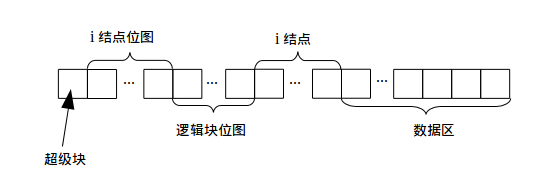  
图 2-1 文件系统各个功能区在磁盘上的布局

### 常量说明

	#define UFS_MAGIC	0x7594	/* 文件系统的标识 */
	#define UFS_NAME_LEN    27	/* 文件名的最大长度, 不包括结尾的空字符 */
	#define UFS_PATH_LEN	1024	/* 路径名最大长度, 不包括结尾的空字符 */
	#define UFS_BLK_SIZE    512	/* 磁盘块大小 */
	#define UFS_OPEN_MAX    64	/* 同时打开文件数最大值 */
	#define UFS_DISK_MAX_SIZE   32	/* 磁盘文件最大值 (MB) */
	#define UFS_DISK_MIN_SIZE   1	/* 磁盘文件最小值 (MB) */
	#define UFS_ROOT_INO	1	/* 根目录的 i 结点号 */

### 主要数据结构

#### 定义

* 逻辑块: 文件系统看待磁盘的方式, 文件系统分配磁盘的最小单位,
1 个逻辑块等于 1 个磁盘块的大小. 逻辑块编号从 1 开始.
* 磁盘块: 访问磁盘的最小单位, 编号从 0 开始, 每一个磁盘块大小为 512 字节.
* 数据块: 单个文件内部数据组成的块, 大小与逻辑块相同, 从 0 开始编号,
数据块号仅在包含它的文件内部有效.

在外部表现上, 逻辑块与磁盘块唯一的不同在于在磁盘上的起始位置不同. 磁盘块从磁盘的第
1 块 512
字节块 就开始, 一直到磁盘的最后一块 512 字节块. 而逻辑块的第 1 块从磁盘的数据区
开始, 该磁盘块前面的几块要预留给超级块, i 结点位图, 逻辑块位图,
与 i 结点使用, 逻辑块从它们之后的第 1 块开始, 从 1 开始编号. 在图 1-1 中, 从左到右,
磁盘块从第 1 块方格开始, 而逻辑块从第 9 块方格开始. 数据块指的是分配给文件, 用来
存储文件数据 (非元数据) 的逻辑块, 如果一个文件的大小为 678 KB,
那么它就拥有 2 块数据块, 数据块号按出现顺序依次为 1, 2.

#### 文件系统超级块

超级块含有整个文件系统的配置信息

	/*
	 * super block in disk.
	 * sizeof(struct ufs_dsuper_block) <= 512
	 */
	struct ufs_dsuper_block {
		unsigned short s_magic; /* 文件系统魔数 */
		unsigned int s_imap_blocks;	/* i 结点位图所占块数, 以逻辑块计 */
		unsigned int s_zmap_blocks;	/* 逻辑块位图所占块数, 以逻辑块计 */
		unsigned int s_inode_blocks; /* i 结点块数, 以逻辑块计 */
		unsigned int s_zone_blocks;	/* 逻辑块块数 */
		off_t	s_max_size;	/* 最大文件长度 */
	};
	
	/* super block in memeory */
	struct ufs_msuper_block {
                unsigned short s_magic; /* 文件系统魔数 */
		unsigned int s_imap_blocks;	/* i 结点位图所占块数, 以逻辑块计 */
		unsigned int s_zmap_blocks;	/* 逻辑块位图所占块数, 以逻辑块计 */
		unsigned int s_inode_blocks; /* i 结点块数, 以逻辑块计 */
		unsigned int s_zone_blocks;	/* 逻辑块块数 */
		off_t	s_max_size;	/* 最大文件长度 */

		/* 下面的字段仅存在于内存中 */
		char *s_imap;		/* i 结点位图 */
		char *s_zmap;		/* 逻辑块位图 */
		unsigned int s_1st_inode_block; /* 第 1 块 i 结点块的磁盘块号 */
		unsigned int s_1st_zone_block; /* 第 1 块逻辑块的磁盘块号 */
		unsigned int	s_inode_left;	/* 剩余 i 结点数 */
		unsigned int s_block_left;	/* 剩余 逻辑块数 */
		int	s_fd;		/* 磁盘文件描述符 */
		void	*s_addr;	/* 磁盘文件在内存中的地址 */
	};

磁盘上的超级块大小要小于 512 字节, 这是因为超级块要完全放入磁盘的第一个磁盘块中.
`s_magic` 用于唯一地识别一个文件系统, 从磁盘上加载了超级块结构后, 如果魔
数正确, 那么就可以断定这是我们想要的文件系统. `s_max_size` 依赖于 i 结点所 
能支持的逻辑块块号数组大小, 以及逻辑块块大小, 在讲解 i 结点时会提到.
`s_zmap_blocks` 决定了文件系统所能支持的最大磁盘大小. 假设 `s_zmap_blocks` 为2,
且 逻辑块大小 为 512 字节, 那么文件系统最多支持 `2 * 512 * 8 * 512 = 4 MB` 大小 
的磁盘. i 结点位图的一个二进制位为 0,
表示相应的 i 结点位空闲; 为 1 则表示相应的 i 结点被占用. "i 结点号" 其实就
是 i 结点相应的位在位图中的下标. 逻辑块位图除了每一个位表示一个逻辑块外,
其他的与 i 结点位图相同.

`s_imap_blocks`, `s_zmap_blocks`, `s_inode_blocks` 与 `s_zone_blocks`
这四个字段需要根据磁盘文件大小动态计算. 本文件系统支持的磁盘大小在 1 MB 到 32 MB 之间,
将该区间分成三个子区间, 对每个子区间的分配策略如下  
* `1 <= size_in_MB <= 10`
  + `s_imap_blocks = 1`;
  + `s_zmap_blocks = 5`;
  + `s_inode_blocks = 256`;
* `10 < size_in_MB < 21`
  + `s_imap_blocks = 1`;
  + `s_zmap_blocks = 11`;
  + `s_inode_blocks = 512`;
* `21 <= size_in_MB <= 32`
  + `s_imap_blocks = 2`;
  + `s_zmap_blocks = 16`;
  + `s_inode_blocks = 1024`;

一旦确定了前三个字段, 最后一个字段 `s_zone_blocks` 便很容易计算得到.

之所以分成 "磁盘上的超级块" 与 "内存中的超级块" 是为了兼顾使用的方便与信息的最
小化. `struct ufs_msuper_block` 结构中多出来的信息可以通过 "磁盘上的超级块" 计算得到,
但如果每次使用时都重新计算比较浪费时间, 所以将这些辅助信息事先计算并存储起来.

为了分辨出 "所有 i 结点都被占用" 与 "所有逻辑块都被占用" 的情况, i 结点位图与
逻辑块位图的第 1 个位不用, 这样就可以通过返回 0 来表示无空闲 i 结点或 
逻辑块, 在初始化文件系统时, 这两位被初始化为 1.

#### i 结点

	/*
	 * 磁盘上的 i 结点.
	 * sizeof(struct ufs_dinode) <= UFS_BLK_SIZE
	 */
	struct ufs_dinode {
		nlink_t	i_nlink;	/* 链接数 */
		mode_t	i_mode;		/* 文件类型和访问权限 */
		off_t	i_size;		/* 文件长度, 以字节计 */
		time_t	i_mtime;	/* 文件内容最后一次被修改的时间 */
		time_t	i_ctime;	/* i 结点最后一次被修改的时间 */
		uid_t	i_uid;		/* 拥有此文件的用户 id */
		gid_t	i_gid;		/* 拥有此文件的用户的组 id */
		/*
		 * 文件内容用到的逻辑块块号数组.
		 *
		 * 0-5: 直接块;
		 * 6: 一次间接块
		 * 7: 二次间接块
		 */
		unsigned int i_zones[8];
	};

	/* 内存中的 i 结点. */
	struct ufs_minode {
		nlink_t	i_nlink;	/* 链接数 */
		mode_t	i_mode;		/* 文件类型和访问权限 */
		off_t	i_size;		/* 文件长度, 以字节计 */
		time_t	i_mtime;	/* 文件内容最后一次被修改的时间 */
		time_t	i_ctime;	/* i 结点最后一次被修改的时间 */
		uid_t	i_uid;		/* 拥有此文件的用户 id */
		gid_t	i_gid;		/* 拥有此文件的用户的组 id */
		/*
		 * 文件内容用到的逻辑块块号数组.
		 *
		 * 0-5: 直接块;
		 * 6: 间接块
		 * 7: 间间接块
		 */
		unsigned int i_zones[8];

		/* 下面的字段仅存在于内存中 */
		unsigned int	i_ino;		/* i 结点号, 从 1 开始, 等价于与该 i 结点对应的二进制位在 i 结点位图中的下标 */
		int	i_refcnt;	/* i 结点被引用的次数 */
	};

`i_nlink` 是指向该 i 结点的目录项的个数, 可用于实现硬链接. `i_mode` 包含了有关文件属性与
权限的信息, 该字段包含的信息如下图

  
图 2-2 `i_mode` 字段中每一位的作用.

`i_mode` 的高位在左, 低位在右. 低 9 位用于判断三类用户对该文件的读写权限,
位 9 用于判断文件类型, 其余位不用.

  
图 2-3 i 结点逻辑块块号数组的功能

如果存放逻辑块号的存储单元的值为 0, 说明该单元空闲.
很容易可以算出一个本文件系统在 32 位平台上所能支持的最大文件为
`(6 + 512/4 + (512/4) * (512/4)) * 512 = 8259 kB`. `struct ufs_minode`
结构中多出来的信息一方面是为了避免重复计算, 另一方面是为完成某些功能, 例如当 i 结点 
的链接数为 0 且引用次数为 0 时, 才可删除文件并回收资源, "引用次数" 指的是
打开文件表 `ufs_open_files` 中指向该 i 结点的项数.

#### 目录项

	/* sizeof(struct ufs_dir_entry) <= UFS_BLK_SIZE */
	struct ufs_dir_entry {
		unsigned int	de_inum;		/* 文件的 i 结点号 */
		char	de_name[UFS_NAME_LEN + 1];	/* 文件名, 以空字符结尾 */
	};

每个目录至少含有 2 个目录项: `.` 与 `..`, 文件系统格式化后只含有一个根目录,
且只有 `.` 与 `..` 这两个目录项. 目录项存放于目录文件的数据块中,
所以单个目录项的大小必须小于或等于一个数据块的大小.

#### 打开文件表

	struct file {
		struct ufs_minode f_inode;		/* 与该文件对应的 i 结点 */
		mode_t	f_mode;			/* 文件类型与访问权限 */
		int	f_flag;			/* 文件打开和控制标志 */
		int	f_count;		/* 对应文件句柄引用次数 */
		off_t	f_pos;			/* 当前文件偏移量 */
	};
	
	struct file ufs_open_files[UFS_OPEN_MAX]; /* 打开文件表 */

`ufs_open_files` 是文件系统存储打开文件信息的表格, 打开文件在表格中的索引将作
为文件描述符使用. `f_mode` 字段的含义与 i 结点的 `i_mode` 字段相同. 
`f_flag` 的标志包括:  
* 文件访问模式:
  + `O_RDONLY`: 只读打开
  + `O_WRONLY`: 只写打开
  + `O_RDWR`: 读写打开
* 文件创建与控制标志:
  + `O_APPEND`: 追加写;
  + `O_TRUNC`: 若打开方式包含写, 则截断文件;

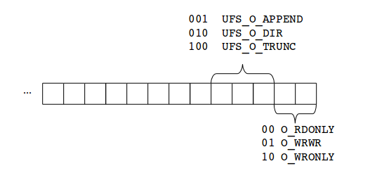  
图 1-4 `f_mode` 字段各位的作用, 高位在左, 低位在右.

3 种文件访问模式必须指定且只能指定一种, 但是文件创建与控制标志都是
可选的.

`f_count` 表示该文件被多少个描述符引用, 例如 `dup()` 函数就可以增加
`f_count` 的值, 当 `f_count` 为 0 时, 该文件从打开文件表中清除, 并
将该项置为空闲状态, 表项是否空闲的依据是 `f_count` 是否为 0.

### 功能函数 (或命令)

* `format` _`diskfile`_
  + 功能: 格式化一个文件系统
  + 命令行参数:
    - 磁盘文件路径, 在挂载文件系统之后, 磁盘文件必须存放在另一个
  文件系统上, 否则行为是未定义的.
  + 程序执行结果: 由参数指定的文件被格式化成一个文件系统, 将作为磁盘使用.
  + 注: 本文提到的磁盘都是指利用普通文件模拟的磁盘, "普通文件" 来源于外部
文件系统 (例如 Ext4), 磁盘作为文件系统的私有数据使用. 一个文件或作为
磁盘使用的条件是: 
    - 大小在 1 MB 到 `UFS_DISK_MAX_SIZE` MB 之间
    - 是普通文件
    - 用户可读写

* `int ufs_read_sb(const char *diskname)`
  + 功能: 从磁盘上读超级块
  + 输入参数:
    - `diskname`: 磁盘文件名
  + 返回值: 成功返回 磁盘文件描述符; 失败返回 -1
  + 注: 超级块作为文件系统的私有数据使用, 所以未在函数签名中显式给出. 
磁盘文件必须曾被 `format` 程序格式化过.

* `unsigned int ufs_new_inode(void)`
  + 功能: 获取一个空闲的 i 结点
  + 返回值: 若找到一个空闲的 i 结点, 返回它的 i 结点号; 否则返回 0
  + 注: i 结点号从 1 开始

* `int ufs_free_inode(unsigned int inum)`
  + 功能: 释放一个指定的 i 结点
  + 输入参数:
    - `inum`: 将被释放的 i 结点的编号
  + 返回值: 若成功返回 0; 若失败返回对应的 `errno` . 以下情况返回失败:
    - i 节点号超出范围 返回 `-EINVAL`;
    - i 节点原来就处理空闲状态, 返回  `-EAGAIN`;

* `int ufs_rd_inode(unsigned int inum, struct ufs_dinode *inode)`
  + 功能: 读取指定的 i 结点
  + 输入参数:
    - `inum`: 被读取的 i 结点的编号
    - `inode`: 存放 i 结点的缓冲区
  + 返回值: 若成功返回 0; 失败返回对应的 `errno`. 以下情况返回失败:
    - i 节点号超出范围, 返回 `-EINVAL`
    - `inode` 为空, 返回 `-EINVAL`;
    - 被调用函数返回错误值, 将错误值原样返回.

* `int ufs_wr_inode(struct ufs_minode *inode)`
  + 功能: 将指定的 i 结点写回磁盘
  + 输入参数:
    - `inode`: 需写回磁盘的 i 结点
  + 返回值: 若成功返回 0; 若失败返回 对应的 `errno`. 错误情况包括:
    - `-EINVAL`: 输入参数不合法, 包括 `inode` 为空, i 结点号无效;
    - 被调用函数返回出错, 将错误值原样返回.

* `unsigned int ufs_new_zone(void)`
  + 功能: 获取一块空闲的逻辑块
  + 返回值: 若找到一块空闲的逻辑块, 返回它的逻辑块号; 否则返回 0
  + 注: 逻辑块用于存储文件数据 (不包括元数据), 是针对于文件系统的; 而磁盘上
的每 512 字节为一个磁盘块, 磁盘块中可以存储任意的内容 (无论是 i 结点, 还是
文件数据), 逻辑块的编号从 1 开始.

* `int ufs_free_zone(unsigned int zone_num)`
  + 功能: 释放一个指定的逻辑块
  + 输入参数: 
    - `zone_num`: 将被释放的逻辑块块号
  + 返回值: 成功时返回 0; 若失败返回 `errno`. 以下情况返回失败:
    - `zone_num` 超出范围, 返回 `-EINVAL`;
    - `zone_num` 原来就处于已释放状态, 返回 `-EAGAIN`;

* `int ufs_rd_zone(unsigned int zone_num, void *buf, size_t size)`
  + 功能: 读一个指定的逻辑块
  + 输入参数: 
    - `zone_num` :将被读取的逻辑块块号
    - `buf`: 存储逻辑块数据的缓冲区
    - `size`: 缓冲区大小, 必须等于逻辑块大小
  + 返回值: 若成功, 返回0; 若失败, 返回 `errno`. 以下情况返回失败:
    - `zone_num` 超出范围, 返回  `-EINVAL`;
    - `buf` 为空, 返回 `-EINVAL`;
    - `size` 不等于 逻辑块大小, 返回 `-EINVAL`;
    - 被调用函数返回出错, 将错误值原样返回.

* `int ufs_wr_zone(unsigned int zone_num, void *buf, size_t size)`
  + 功能: 将一个指定的逻辑块写入磁盘
  + 输入参数:
    - `zone_num`: 逻辑块块号
    - `buf`:写入逻辑块的缓冲区
    - `size`: 缓冲区大小, 必须等于逻辑块大小
  + 返回值: 成功返回 0; 失败返回 `errno`. 以下情况返回失败:
    - `zone_num` 超出范围, 返回 `-EINVAL`;
    - `buf` 为空, 返回 `-EINVAL`;
    - `size` 不等于 逻辑块大小, 返回 `-EINVAL`;
    - 被调用函数返回出错, 将错误值原样返回.

* `unsigned int inum2bnum(unsigned int inum)`
  + 功能: 计算指定的 i 结点所在的磁盘块块号
  + 输入参数:
    - `inum`: 待计算的 i 结点号
  + 返回值: 编号为 `inum` 的 i 结点所在的磁盘块块号. 若 `inum` 无效,
返回 0.
  + 注: 磁盘的第一个块被超级块占用, 故 0 号磁盘块不会被用到, 可用
作指示错误的返回值.

* `unsigned int znum2bnum(unsigned int zone_num)`
  + 功能: 计算指定的逻辑块所在的磁盘块块号
  + 输入参数:
    - `zone_num`: 待计算的逻辑块块号
  + 返回值: 编号为 `zone_num` 的逻辑块所在的磁盘块块号. 若 `zone_num`
无效则返回 0.

* `unsigned int dnum2znum(struct ufs_minode *inode, unsigned int data_num)`
  + 功能: 计算指定的数据块所在的逻辑块号
  + 输入参数:
    - `inode`: 数据块所在的 i 结点指针.
    - `data_num`: 数据块号
  + 返回值: 若数据块号与 i 结点有效, 且数据块存在, 返回对应的逻辑块号; 否则返回 0.
  + 注: "数据块" 是相对于单个文件的, 从 1 开始编号, 数据块号最大值
受限于 i 结点所能支持的最大文件大小.

* `unsigned int ufs_creat_zone(struct ufs_minode *inode, unsigned int dnum)`
  + 功能: 计算指定的数据块所在的逻辑块号, 若不存在则创建一块;
  + 输入参数:
    - `inode`: 数据块所在的 i 结点指针;
    - `dnum`: 数据块块号;
  + 返回值: 若数据块号与 i 结点有效, 文件大小未达到上限且磁盘有空闲逻辑块,
则返回对应的逻辑块号; 否则返回 0.

* `int ufs_rd_blk(unsigned int blk_num, void *buf, size_t size)`
  + 功能: 从磁盘上读一块指定的磁盘块
  + 输入参数:
    - `blk_num`: 将被读的磁盘块块号
    - `buf`: 存储磁盘块的缓冲区
    - `size`: 缓冲区大小, 必须等于磁盘块大小
  + 返回值: 若成功返回 0; 失败返回 `errno`. 以下情况返回失败:
    - `blk_num` 无效, 返回 `-EINVAL`;
    - `buf` 为空, 返回 `-EINVAL`;
    - `size` 不等于磁盘块大小, 返回 `-EINVAL`;
    - 被调用函数返回出错, 将错误值原样返回.
  + 注: 磁盘文件上的每 512 字节都算作一个磁盘块, 而不管该磁盘块存放的是什么
内容, 下同.

* `int ufs_wr_blk(unsigned int blk_num, void *buf, size_t size)`
  + 功能: 写一块指定的磁盘块
  + 输入参数:
    - `blk_num`: 将被写入的磁盘块的块号
    - `buf`: 写入磁盘块的缓冲区
    - `size`: 缓冲区大小, 必须等于磁盘块大小
  + 返回值: 若成功返回 0; 失败返回 -1, 以下情况返回失败:
    - `blk_num` 无效, 返回 `-EINVAL`;
    - `buf` 为空, 返回 `-EINVAL`;
    - `size` 不等于磁盘块大小, 返回 `-EINVAL`;
    - 被调用函数返回出错, 将错误值原样返回.

* `int ufs_path2i(const char *path, struct ufs_minode *inode)`
  + 功能: 将路径名映射为 i 结点
  + 输入参数:
    - `path`: 被映射的路径名;
    - `inode`: 存放映射后的 i 结点;
  + 返回值: 成功返回 0, 失败返回 `errno`, 失败包括:
    - `path` 为空或过长, 返回 `-EINVAL`;
    - `inode` 为空, 返回 `-EINVAL`;
    - 被调用函数返回出错, 将错误值原样返回.

* `int ufs_dir2i(const char *dirpath, struct ufs_minode *dirinode)`
  + 功能: 将目录的路径名映射为对应的 i 结点;
  + 输入参数: 
    - `dirpath`: 目录的路径名;
    - `dirinode`: 存放映射后的 i 结点;
  + 返回值: 成功返回 0, 失败返回 `errno`, 错误情况包括
    - 路径引用的文件不是一个目录文件, 返回 `-ENOTDIR`;
    - 被调用函数返回出错, 将错误值原样返回.

* `int ufs_find_entry(struct ufs_minode *parent, const char *filename, struct ufs_dir_entry *ent)`
  + 功能: 在指定的目录中查找具有指定文件名的文件
  + 输入参数:
    - `parent`: 查找的位置, 必须是目录;
    - `filename`: 待查找的文件名;
    - `ent`: 若查找成功, 存放被查找文件的目录项
  + 返回值: 查找成功返回 0; 失败返回 `errno`, 失败包括:
    - 任一输入参数为空或无效, 返回 `-EINVAL`;
    - `parent` 不是一个目录, 返回 `-ENOTDIR`;
    - 未找到与 `filename` 对应 的目录项, 返回 `-ENOENT`;
    - 被调用函数返回出错, 将错误值原样返回.

* `int ufs_rm_entry(struct ufs_minode *dir, const struct ufs_dir_entry *entry)`
  + 功能: 从指定的目录中移除指定的目录项;
  + 输入参数:
    - `dir`: 在该目录中移除一个目录项;
    - `entry`: 被移除的目录项;
  + 返回值: 移除成功返回 0; 失败返回 `errno`. 在以下情况返回失败:
    - 任一参数为空, 返回 `-EINVAL`;
    - `dir` 不是一个目录, 返回 `-ENOTDIR`;
    - 目录中不存在被移除的目录项, 返回 `-ENOENT`;
    - 目录大小与数据块数不匹配, 返回 `-EIO`;
    - 被调用函数返回出错, 将错误值原样返回.

* `int ufs_add_entry(struct ufs_minode *dir, const struct ufs_dir_entry *entry)`
  + 功能: 在指定的目录中新增一个目录项
  + 输入参数:
    - `dir`: 在该目录中新增一个目录项;
    - `entry`: 新增的目录项
  + 返回值: 添加成功返回 0; 失败返回 `errno`. 在以下情况返回失败：
    - 任一参数为空, 返回 `-EINVAL`;
    - `dir` 不是一个目录, 返回 `-ENOTDIR`;
    - 没有磁盘空间存放目录项, 返回 `-ENOSPC`;
    - 被调用函数返回出错, 将错误值原样返回.

* `int ufs_truncate(struct ufs_minode *iptr)`
  + 功能: 释放 i 结点占用的所有数据块
  + 输入参数:
    - `iptr`: 将被截断的 i 结点指针;
  + 返回值:
    - 成功返回 0; 失败返回 `errno`. 在以下情况返回失败:
    - `iptr` 为空返回 `-EINVAL`;
    - 被调用函数返回出错, 将错误值原样返回.

* `int ufs_is_dirempty(struct ufs_minode *inode)`
  + 功能: 判断目录是否为空 (即只包含 `.` 与 `..` 这两个目录项);
  + 输入参数:
    - `inode`: 目录的 i 结点;
  + 返回值: 若 目录只包含 `.` 与 `..` 这两个目录项, 返回 1; 以下情况返回 0:
    - `inode` 为空;
    - `inode` 不是一个目录文件;
    - `inode` 包含除了 `.` 与 `..` 之外的目录项;

* `mode_t ufs_conv_fmode(mode_t mode)`
  + 功能: 将标准的文件类型及访问权限标志转换成本文件系统支持的文件类型及访问权限标志;
  + 输入参数:
    - `mode`: Linux 标准的文件类型及访问权限标志;
  + 返回值: 本文件系统的标准文件类型与文件访问权限标志, 无出错标志.

* `int ufs_conv_oflag(int oflag)`
  + 功能: 将 Linux 标准的文件打开标志转换成本文件系统的打开标志;
  + 输入参数:
    - `oflag`: Linux 标准的文件打开标志;
  + 返回值:
    - 本文件系统的支持的打开标志, 无出错标志;

### 功能函数详细流程
**TODO**

### 系统调用接口

* `int creat(const char *path, mode_t mode)`  
  + 功能: 创建一个新文件
  + 输入参数:
    - `path`: 新文件的路径;
    - `mode`: 新文件的访问权限.
  + 返回值:
    - 若成功, 返回只写打开的文件描述符;
    - `-EACCES`: 进程无权限搜索目录; 进程无权限写新文件的父目录;
    - `-EEXIST`: 新文件名已存在.
    - `-EISDIR`: `path` 引用的是目录;
    - `-ENAMETOOLONG`: 路径名过长或文件名过长;
    - `-ENFILE`: 文件系统无空间存放新打开的文件;
    - `-ENOENT`: `path` 中的某一前缀目录不存在;
    - `-ENOSPC`: 硬盘空间不足;
    - `-ENOTDIR`: `path` 中的某一前缀不是目录;
    - `-EINVAL`: 含有无效参数;
  + 函数过程:
    - 如果 `path` 为空, 或长度为 0, 返回 `-EINVAL`;
    - 若 `path` 超过最大路径长度, 返回 `-ENAMETOOLONG`;
    - 在 `ufs_open_files` 表中查找空闲项, 若无空闲项,
      返回 `-ENFILE`; 若找到, 记空闲项的索引为 `fd`;
    - 调用 `parpath = dirname(path)` 与 `base = basename(path)`,
      获取前缀路径 与 新文件名;
    - 如果 `base` 长度超过最大文件名长度, 返回 `-ENAMETOOLONG`;
    - 调用 `ufs_dir2i(parpath, parinode)` 获取父目录的 i 结点, 若函数出错,
      原样返回错误值;
    - 调用 `ufs_find_entry(parinode, base, entry)`, 在父目录查找是否已存在新文件
      的目录项;
    - 若 `ufs_find_entry` 的返回值为 0, 返回 `-EEXIST`; 若返回值是除了 `-ENOENT`
      之外的其他值, 原样返回错误值.
    - 调用 `inum = ufs_new_inode()` 获取一个空闲的 i 结点, 若返回 值 为0, 返回 `-ENOSPC`;
    - 初始化一个 i 结点 `inode`, 将它的 i 结点号设置为 `inum`, 并调用 `ufs_wr_inode(inode)`,
      若 `ufs_wr_inode` 出错, 原样返回错误值.
    - 初始化一个新文件的目录项 `entry`, 调用 `ufs_add_entry(parinode, entry)`, 在父目录中 
      添加该目录项, 若 `ufs_add_entry` 出错, 原样返回错误值
    - 用新文件的 i 结点 `inode` 初始化 `ufs_open_files[fd]`;
    - 在即将返回时, 如果前面发生了错误, 而申请过 i 结点, 则释放申请到的
      i 结点.
  + 注: `creat(const char *path, mode_t mode)` 等价于
`open(path, O_WRONLY | O_CREAT | O_TRUNC, mode)`,  但无法通过 fuse 获取不
定参数, 故无法通过 `open` 实现 `creat`.
  + 流程图 (图中未画出的判断分支都表示返回或出错返回)  

* `int release(const char *path, int fd)`
  + 功能: 关闭一个打开文件, 并释放它占用的资源;
  + 输入参数:
    - `path`: 将被释放的文件路径名, 不用;
    - `fd`: 打开文件的描述符;
  + 返回值:
    - 若成功返回 0;
    - `-EBADF`: `fd` 超出有效范围, 或文件未打开;
  + 函数过程:
    - 判断 `fd` 是否在有效范围内, 若不是, 返回 `-EBADF`;
    - 判断 `ufs_open_files[fd]` 是否已打开 (即判断 `ufs_open_files[fd].f_count` 是否非 0),
      若未打开, 返回 `-EBADF`;
    - `ufs_open_files[fs].f_count` 减 1;
    - 返回.

* `int releasedir(const char *path)`
  + 功能: 释放一个打开的目录;
  + 输入参数:
    - `path`: 目录的路径名 (不用);
  + 返回值:
    - 总是返回 0 (成功);
  + 函数过程:
    - 函数体无实质性内容, 直接返回 0;

* `int rename(const char *oldpath, const char *newpath)`
  + 功能: 改变文件的位置或 (和) 名字;
  + 输入参数:
    - `oldpath`: 旧文件的路径;
    - `newpath`: 新文件的路径;
  + 返回值:
    - 成功返回 0;
    - `-EINVAL`: 路径名为空或长度为 0; 或试图将某个目录作为它自己的子
      目录;
    - `-EACCES`: 对 `oldpath` 或 `newpath` 的父目录无写权限; 或者对路径
      中的某一前缀目录无搜索权限; 或者 `oldpath` 是一个目录文件, 但是对
      用户对该目录无写权限 (需要更新 `..` 目录项);
    - `-EBUSY`: `oldpath` 或 `newpath` 是根目录;
    - `-EISDIR`: `newpath` 是一个已存在的目录, 但是 `oldpath` 不是一个目录 
      文件;
    - `-ENAMETOOLONG`: `oldpath` 或 `newpath` 长度大于最大路径名长度;
    - `-ENOENT`: `oldpath` 不存在, 或 `newpath` 中某个前缀目录部分不存在;
    - `-ENOSPC`: 没有多余的空间存放新目录项;
    - `-ENOTDIR`: 路径中的某一前缀目录不是一个目录文件; 或 `oldpath` 是一 
      个目录文件, 但是 `newpath` 已存在, 但不是一个目录文件;
    - `-ENOTEMPTY`: `newpath` 是一个非空目录;
  + 流程图 (图中未画出的分支都表示出错):  

* `int mkdir(const char *path, mode_t mode)`
  + 功能: 创建一个空目录;
  + 输入参数:
    - `path`: 新目录的路径名;
    - `mode`: 新目录的访问权限;
  + 返回值:
    - 若成功, 返回 0;
    - `-EINVAL`: `path` 为空, 或长度为 0;
    - `-EACCES`: 用户对新目录的父目录无写权限, 或者, 对路径中的某一目录
      无搜索权限;
    - `-EEXIST`: `path` 引用的文件 (不一定非是目录) 已存在;
    - `-ENAMETOOLONG`: `path` 过长;
    - `-ENOENT`: `path` 中的某个前缀目录不存在;
    - `-ENOSPC`: 磁盘空间不足, 或父目录无空闲空间存放新目录项;
    - `-ENOTDIR`: `path` 的某个前缀目录不是一个目录文件;
  + 函数过程:
    - 若 `path` 为 `NULL`, 或长度为 0, 返回 `-EINVAL`;
    - 若 `path` 长度大于最大路径名长度, 返回 `-ENAMETOOLONG`;
    - 从 `path` 中分离出前缀目录与新目录名, `dir = dirname(path); base = basename(path)`,
      若 `base` 长度超过最大文件名长度, 返回 `-ENAMETOOLONG`;
    - 调用 `ufs_dir2i(dir, parent)`, 若调用出错, 原样返回错误值;
    - 调用 `ufs_find_entry(parent, base)`, 在父目录 `parent` 中查找新目录名 `base`. 若函数返回
      值是 `0`, 返回 `-EEXIST`; 若返回值不是 `-ENOENT`, 原样返回错误值.
    - 调用 `ufs_new_inode()` 为新目录申请一个 i 结点号, 若返回值为 0, 返回 `-ENOSPC`;
    - 初始化新目录的 i 结点 `dirinode`, 调用 `ufs_add_entry(dirinode, entry)`, 为新目录添加
      两个目录项 `.` 与 `..`, 若出错, 原样返回错误值;
    - 调用 `ufs_wr_inode(dirinode)` 将新目录的 i 结点写盘, 若出错, 原样返回错误值;
    - 初始化一个新目录的目录项, 调用 `ufs_add_entry(parent, entry)`, 在父目录中新增一个目录项,
      若出错, 原样返回错误值, 更新父目录的 链接数 `i_nlink`,  调用 `ufs_wr_inode(parent)` 将父
      目录的 i 结点写盘; 若出错, 原样返回错误值;
    - 在函数即将返回前, 检查前面的步骤是否有错误发生, 若有, 且已经为新目录申请了 i 结点, 则将
      新申请的 i 结点释放 (`ufs_free_inode(newdirinode->i_ino)`;
    - 返回.
  + 流程图 (图中未画出的分支都表示出错):  

* `int readdir(const char *dirpath)`
  + 功能: 读某个目录中的所有项
  + 输入参数:
    - `dirpath`: 目录的路径;
  + 返回值:
    - 若成功, 返回 0;
    - `-ENOTDIR`: `dirpath` 引用的不是一个目录, 或路径中的某个部分不是一个目录;
    - `-ENOENT`: 路径中的某个目录不存在
    - `-ENAMETOOLONG`: 路径名过长
    - `-EINVAL`: 路径名为空或长度为 0;
    - `-ENOMEM`: 内存不足;
    - `-EIO`: 发生了一个 I/O 错误;
  + 函数过程 
    - 若 `dirpath` 为空或长度为0, 返回 `-EINVAL`;
    - 若 `dirpath` 长度大于最大路径名长度, 返回 `-ENAMETOOLONG`;
    - 调用 `ufs_dir2i(dirpath, dirinode)`, 若返回出错, 原样返回错误值;
    - 循环读取 `dirinode` 所有的数据块, 对数据块 `dnum`, 调用 `ufs_dnum2znum`, 若
      返回的逻辑块号 `znum` 为 0 而目录项还未读取完毕, 说明目录处于一种不一致的状态,
      返回 `-EIO`; 否则递增 `dnum`, 继续循环;
    - 调用 `ufs_rd_zone(znum, buf)`, 从磁盘上读取逻辑块到缓冲区 `buf` 中; 若出错, 原样返回错误值;
    - 将 `buf` 当作 `struct ufs_dir_entry` 的数组来使用; 若读取到一个 `buf[i].de_inum` 不为0 的
      元素, 则输出目录项, 并递增读取的到目录项项数.
    - 若所有的目录项都已读取完毕, 则退出循环.
    - 返回.
* `int unlink(const char *path)`
  + 功能: 删除一个目录项;
  + 输入参数:
    - `path`: 文件的路径;
  + 返回值:
    - 成功返回 0;
    - `-EINVAL`: 路径为空, 或长度为 0;
    - `-EACCES`: 对文件的父目录无写权限, 或对路径中的目录无搜索权限;
    - `-EISDIR`: 路径名引用的是目录文件;
    - `-ENAMETOOLONG`: 路径名或文件名过长;
    - `-ENOENT`: 文件不存在, 或路径中的某个目录不存在;
    - `-ENOTDIR`: 路径中的某一前缀目录不是一个目录文件;
  + 函数过程:
    - 若 `path` 为空, 或长度为 0, 返回 `-EINVAL`;
    - 若 `path` 长度大于最大路径名长度, 返回 `-ENAMETOOLONG`;
    - 调用 `dir = dirname(path)` 与 `file = basename(path)` 获取路径中的目录中的目录名,
      与 文件名, 若文件名过长, 则会被截断;
    - 调用 `ufs_path2i(path, inode)` 获取将被删除的文件的 i 结点, 若函数出错, 原样返回错误值;
    - 如果 `inode` 是一个目录文件, 返回 `-EISDIR`;
    - 调用 `ufs_dir2i(dir, parinode)` 获取父目录的的 i 结点, 若函数出错, 原样返回错误值;
    - 调用 `ufs_rm_entry(parinode, entry)`, 从父目录中删除一个目录项, 若函数出错, 原样返回错误值.
    - 调用 `ufs_wr_inode(parinode)` 将父目录 i 结点写盘;
    - 为 `inode.i_nlink` 减一, 减 1 后不为零, 调用 `ufs_wr_inode(inode)` 将 i 结点写盘; 若为 0, 调用 
      `ufs_truncate(inode)` 将文件截断, 若出错, 原样返回错误值, 截断后调用 `ufs_free_inode(inode.i_ino)` 释放
      i 结点.
    - 返回
  + 流程图 (图中未画出的分支都表示出错):  

* `int rmdir(const char *path)`
  + 功能: 删除一个空目录;
  + 输入参数:
    - `path`: 目录的路径名;
  + 返回值:
    - 成功返回 0;
    - `-EINVAL`: 目录为空, 或长度为 0;
    - `-EACCES`: 对目录的父目录无写权限, 或对路径中的目录无搜索权限;
    - `-ENAMETOOLONG`: `path` 路径名过长;
    - `-ENOENT`: 目录不存在, 或路径中的某个目录不存在;
    - `-ENOTDIR`: `path` 引用的不是一个目录, 或路径中的某个部分不是一个目录;
    - `-ENOTEMPTY`: `path` 引用的不是一个空目录;
    - `-EPERM`: `path` 引用的是根目录;
  + 函数过程:
    - 若 `path` 为空, 或长度为 0, 返回 `-EINVAL`;
    - 若 `path` 长度大于最大路径名长度, 返回 `-ENAMETOOLONG`;
    - 若 `path` 引用是根目录, 返回 `-EPERM`;
    - 调用 `ufs_dir2i(path, inode)`, 若函数出错, 原样返回错误值;
    - 如果 `inode` 不是一个目录, 返回 `-ENOTDIR`;
    - 调用 `ufs_is_dirempty(inode)`, 如果目录不空, 返回 `-ENOTEMPTY`;
    - 调用 `dir = dirname(path)` 获取 `path` 的目录部分;
    - 调用 `ufs_dir2i(dir, parinode)`, 获取父目录的 i 结点, 若函数出错, 原样返回错误值;
    - 调用 `ufs_rm_entry(parinode, ent)` 移除将被删除的目录的目录项, 若函数出错, 原样返回错误值;
    - 调用 `ufs_wr_inode(parinode)` 将父目录的 i 结点写盘;
    - 调用 `ufs_truncate(inode)`, 释放将被删除的目录占用的数据块;
    - 调用 `ufs_free_inode(inode)`, 释放目录的 i 结点;
    - 返回.
  + 流程图 (图中未画出的判断分支都表示返回或出错返回)  

* `int open(const char *path, int flag)`;
  + 功能: 打开一个文件;
  + 输入参数:
    - `path`: 文件路径;
    - `flag`: 打开标志, 包括 `O_RDWR`, `O_RDONLY`, `O_WRONLY`, `O_APPEND`,
      `O_DIR`, `O_TRUNC`;
  + 返回值:
    - 若成功返回非负的文件描述符;
    - `-EINVAL`: `path` 为空或长度为 0;
    - `-ENOTSUP`: `flag` 包含本文件系统还不支持的打开标志;
    - `-ENAMETOOLONG`: `path` 长度大于最大路径名长度;
    - `-EACCES`: 对文件的打开请求不被允许 (例如打开标志指定了 `UFS_O_RDWR`, 但文件不可写), 或路径中的某目录
      无搜索权限;
    - `-EISDIR`: `path` 引用的是目录, 而打开标志包含写;
    - `-ENFILE`: 文件系统无空间存放新打开的文件;
    - `-ENOENT`: 文件不存在, 或路径中的某个目录不存在;
    - `-ENOTDIR`: 路径中的某一前缀目录不是一个目录文件, 或打开标志指定了 `UFS_O_DIR`, 但 `path` 不是一个目录文件;
  + 函数过程:
    - 若 `path` 为空, 或长度为 0, 返回 `-EINVAL`;
    - 调用 `ufs_conv_oflag(flag)` 将 Linux 标准的文件打开标志转换成本文件系统的打开标志;
    - 若 `path` 长度大于最大路径名长度, 返回 `-ENAMETOOLONG`;
    - 遍历 `ufs_open_files[]`, 寻找空闲项, 若没有空闲项, 返回 `-ENFILE`; 若找到, 记空闲项下标为 `fd`;
    - 调用 `ufs_path2i(path, inode)`, 获取文件的 i 结点号, 若函数出错, 原样返回错误值;
    - 若 `flag` 包含写操作 (`UFS_O_WRONLY`, `UFS_O_RDWR` 等), 而 `path` 是一个目录文件, 返回 `-EISDIR`;
    - 若 `flag` 指定了 `UFS_O_DIR`, 但 `path` 不是一个目录文件, 返回 `-ENOTDIR`;
    - 若 `flag` 指定了 `UFS_O_TRUNC`, 则调用 `ufs_truncate(inode)` 与 `ufs_wr_inode(inode)`, 若函数出错,
      原样返回错误值;
    - 初始化 `ufs_open_files[fd]` 的各个字段, 返回 `fd`;
  + 流程图 (图中未画出的判断分支都表示返回或出错返回)  

* `int write(int fd, const void *buf, size_t size, off_t offset)`
  + 功能: 写一个文件;
  + 输入参数:
    - `fd`: 打开文件描述符;
    - `buf`: 数据缓冲区;
    - `size`: 写入的数据量, 数据量大于 0;
    - `offset`: 写入点的起始偏移量;
  + 返回值:
    - 若成功返回 写入的数据量;
    - `-EBADF`: `fd` 不是一个有效的文件描述符, 或没有打开, 或打开文件时没有指定写标志;
    - `-EIO`: 底层写函数出错;
    - `-ENOSPC`: 磁盘空间不足;
    - `-EINVAL`: `buf` 为空, 或 `size` 小于等于 0, 或 `offset` 超过文件大小;
    - `-EFBIG`: 文件过大;
  + 函数过程:
    - 若 `fd` 不是一个有效的文件描述符, 或没有打开, 或打开文件时没有指定写标志, 返回 `-EBADF`;
    - 若 `buf` 为空, 或 `size` 小于等于 0, 返回 `-EINVAL`;
    - 若 `offset` 大于等于文件大小, 返回 `-EINVAL`;
    - 将文件的当前读写偏移量 `pos` 设置为 `offset`, 若打开文件时指定了 `UFS_O_APPEND`, 将 `pos`
      设置为文件的当前大小;
    - 当还有剩余的数据未写时, 循环;
    - 利用 除运算与取模运算, 计算当前要写的偏移在文件中的数据块号, 与数据块内的偏移量;
      调用 `ufs_creat_zone(dnum)` 获取数据块号对应的逻辑块号, 若返回 0, 判断是否是因为文件过大,
      若是, 置 `ret = -EFBIG`; 否则置 `ret = -ENOSPC`, 退出循环;
    - 调用 `ufs_rd_zone(znum, buf)` 读一块数据, 并将要写入的数据写入 `buf`, 再调用 
      `ufs_wr_zone(znum, buf)` 将逻辑块写盘;
    - 更新文件读偏移量, 若超过文件大小, 同时更新文件 i 结点的大小, 并写盘;
    - 若还有数据未写完, 则继续循环, 否则退出循环;
    - 在循环结束后, 如果文件打开时没有设置追加写, 则更新文件当前读写偏移量;
    - 若前面没有出错, 返回已写的数据量, 否则返回错误值;
  + 流程图 (图中未画出的判断分支都表示返回或出错返回)  
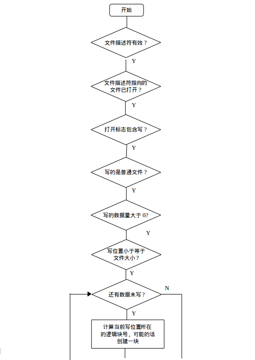

* `int read(int fd, void *buf, size_t size)`
  + 功能: 读一个文件;
  + 输入参数:
    - `fd`: 打开文件的描述符;
    - `buf`: 数据缓冲区;
    - `size`: 期望读到的字节数;
  + 返回值:
    - 若成功返回读取到的字节数, 0 表读到文件末尾;
    - `-EBADF`: 文件描述符无效, 或未打开, 或打开时没有指定读标志;
    - `-EIO`: 发生 I/O 错误;
    - `-EISDIR`: `fd` 引用的是一个目录文件;
  + 函数过程:
    - 若 `fd` 无效, 或未打开, 或打开时没有指定读标志, 返回 `-EBADF`;
    - 若 `buf` 为空, 或 `size` 为 0, 返回 0;
    - 若 `ufs_open_files[fd].f_inode` 引用的是一个目录文件, 返回 `-EISDIR`;
    - 获取文件的当前读偏移量 `pos`;
    - 当未遇到文件末尾且未读满 `size` 个字节时, 循环;
    - 将读到的数据复制到 `buf` 中, 若出错, 原样返回错误值;
    - 每读完一个单元的数据, 就更新文件的当前读写偏移量.
    - 退出循环后, 返回读到的数据量.
  + 流程图 (图中未画出的判断分支都表示返回或出错返回)  

* `int getattr(const char *path, struct stat *st)`
  + 功能: 获取文件的元数据;
  + 输入参数:
    - `path`: 文件的路径;
    - `st`: 存放文件元数据的缓冲区;
  + 返回值:
    - 若成功, 返回 0;
    - `-EINVAL`: `path` 为空, 或长度为 0, 或 `st` 为空指针;
    - `-EACCES`: 对路径中的某一目录无搜索权限;
    - `-ENAMETOOLONG`: 路径过长, 若文件名过长;
    - `-ENOENT`: 路径中的某一部分不存在;
    - `-ENOTDIR`: 路径中的某一前缀目录不是一个目录文件;
  + 函数过程: 
    - 若 `path` 为空, 或长度为 0, 或 `st` 是空指针, 返回 `-EINVAL`;
    - 调用 `ufs_path2i(path, inode)`, 若函数出错, 原样返回错误值;
    - 将 `inode` 中与 Linux 兼容的字段 (`i_ino`, `i_nlink`, `i_uid`,
      `i_gid`, `i_size`, `i_ctime`, `i_mtime`) 赋值给 `st`,  并调用
      `ufs_conv_fmode(inode.i_mode)` 将 文件类型及权限 (`i_mode`)
      转换为标准格式.
    - 返回.

* `int access(const char *path, int mode)`
  + 功能: 按照进程的实际用户 ID 与实际组 ID 来测试文件的读写权限;
  + 输入参数:
    - `path`: 文件的路径;
    - `mode`: 需要检查的权限;
  + 返回值:
    - 若成功返回 0;
    - `-EINVAL`: `path` 为空, 或长度为 0, 或 `mode` 包含无效参数 (除了
      `F_OK`, `R_OK`, `W_OK`, `X-OK`)
    - `-EACCES`: 请求的权限被拒绝, 或 `path` 中某个前缀目录不允许搜索;
    - `-ENAMETOOLONG`: 路径名过长, 或文件名过长;
    - `-ENOENT`: 路径中的某一部分不存在;
    - `-ENOTDIR`: 路径中的某一前缀目录不是一个目录文件;
    - `-EIO`: 发生了一个 I/O 错误;
  + 函数过程:
    - 若 `path` 为空, 或长度为 0, 返回 `-EINVAL`;
    - 若 `mode` 包含无效参数, 返回 `-EINVAL`;
    - 若 `path` 长度超过最大文件名长度, 返回 `-ENAMETOOLONG`;
    - 调用 `ufs_path2i(path, inode)`, 若函数出错, 原样返回错误值;
    - 若 `mode == F_OK`, 返回 0;
    - 根据进程的身份, 取出与它对应的文件权限, 
      若 `inode.i_mode` 具备 `mode` 所请求的权限, 返回 0, 否则返回
      `-EACCES`;

* `int mknod(const char *path, mode_t mode, dev_t dev)`
  + 功能: 创建一个普通文件;
  + 输入参数:
    - `path`: 新文件的路径;
    - `mode`: 新文件的访问权限与文件类型 (目前只支持普通文件类型);
    - `dev`: 设备文件的设备号 (不用);
  + 返回值:
    - 若成功返回 0;
    - `-EACCES`: 进程无权限搜索目录; 进程无权限写新文件的父目录;
    - `-EEXIST`: 新文件名已存在.
    - `-ENAMETOOLONG`: 路径名过长;
    - `-ENOENT`: `path` 中的某一前缀目录不存在;
    - `-ENOSPC`: 硬盘空间不足;
    - `-ENOTDIR`: `path` 中的某一前缀不是目录;
    - `-EINVAL`: 含有无效参数;
    - `-ENOTSUP`: 请求创建的文件类型不支持;
  + 函数过程:
    - 若 `path` 为空, 或长度为 0, 返回 `-EINVAL`;
    - 若 `path` 长度超过最大文件名长度, 返回 `-ENAMETOOLONG`;
    - 若 `mode` 不是一个普通文件类型, 返回 `-ENOTSUP`;
    - 调用 `creat(path, mode, &fi)`, 若函数出错, 原样返回错误值;
    - 调用 `release(fi.fh)`, 关闭文件 (因为 `creat()` 会打开文件);
  + 注: 由于文件系统目前只支持目录文件与普通文件这两种类型,
    所以现在主要通过 `creat()` 来实现 `mknod()`;

* `int statfs(const char *path, struct statvfs *stat)`
  + 功能: 获取文件系统的统计信息;
  + 输入参数:
    - `path`: 文件系统内部的某个文件的路径;
    - `stat`: 存放文件系统统计信息的缓冲区;
  + 返回值: 
    - 若成功返回 0;
    - `-EIO`: 发生了一个 I/O 错误;
    - `-EINVAL`: `path` 为空, 或长度为 0, 或 `stat` 为空指针;
  + 函数过程:
    - 若 `path` 为空, 或长度为 0, 或 `stat` 为空指针, 返回  `-EINVAL`;
    - 从超级块中获取各种统计信息, 并赋给 `stat` 相应的字段 (`f_bsize`,
      `f_bfree`, `f_bavail`, `f_files`, `f_ffre`, `f_namemax`);
      若获取过程中出错, 返回 `-EIO`;
    - 返回;

* `int opendir(const char *path)`
  + 功能: 打开一个目录;
  + 输入参数:
    - `path`: 目录的路径;
  + 返回值:
    - 若成功返回 0;
    - `-EINVAL`: `path` 为空, 或长度为 0;
    - `-ENAMETOOLONG`: `path` 长度超过最大文件名长度;
    - `-ENOENT`: 路径中的某个目录不存在;
    - `-ENOTDIR`: `path` 引用的不是一个目录, 或路径中的某个部分不是一个目录;
    - `-EACCES`: 搜索请求被拒绝;
  + 函数过程:
    - 若 `path` 为空, 或长度为 0, 返回 `-EINVAL`;
    - 若 `path` 长度大于最大路径名长度, 返回 `-ENAMETOOLONG`;
    - 调用 `ufs_dir2i(path, inode)`, 若函数出错, 原样返回错误值;
    - 返回.

* `int closedir(DIR *dirp)`
  + 功能: 关闭一个打开着的目录文件;
  + 输入参数:
    - `dirp`: 指向打开着的目录文件的指针;
  + 返回值:
    - 若成功返回 0;
    - `-EBADF`: `dirp` 的文件描述符无效;
  + 函数过程:
    - 若 `dirp` 是一个空指针, 返回 `-EBADF`;
    - 返回;

* `int flush(const char *path)`:
  + 功能: 冲洗文件;
  + 输入参数:
    - `path`: 被冲洗的文件路径;
  + 返回值:
    - 总是返回 0 (成功);
  + 函数过程:
    - 函数体无实质性内容, 直接返回 0;

* `int fsync(const char *path, int datasync, struct fuse_file_info *fi)`
  + 功能: 同步文件;
  + 输入参数:
    - `path`: 不用;
    - `datasync`: 同步标志, 非 0 则仅同步数据; 0 则同步数据与元数据;
    - `fi`: 不用;
  + 返回值:
    - 若成功返回 0;
    - `-EBADF`: 文件描述符无效;
    - `-EIO`: 发生了一个 I/O 错误;
    - `-EINVAL`: 文件不支持 同步.
  + 函数过程:
    - 若 `datasync` 非 0, 调用 `fdatasync(sb.s_fd)`, 若函数出错, 返回 
      `-errno`; 成功返回 0;
    - 若 `datasync` 为 0, 调用 `fsync(sb.s_fd)`, 若函数出错, 返回 `-errno`;
      成功返回 0;

## 测试与演示

### 测试环境
  * ubuntu 14.04 32-bits
  * fuse 2.9.4
  * 磁盘文件 30 MB
    + i 结点位图块数为 2 块, 可管理 `2 * 512 * 8 - 1 = 8191` 个 i 结点;
    + i 结点数据块数为 1024 块, 包含 `512 / 64 * 1024 = 8192` 个 i 结点;
    + 逻辑块位图块数为 16, 可管理 `16 * 512 * 8 = 65536` 个逻辑块 (32 MB);
    + 文件系统逻辑块块数为 60397 块;
  * 最大文件长度 8259 KB;
  * 最大文件名长度 27 B;
  * 带有前缀 `./` 的命令都是用户自已开放的命令, 非系统提供, 测试者可在
    tools/ 目录下找到命令的源代码.

### 测试环境搭建

* 编译源码  

	`$ cd src/`  
	`$ make`

* 格式化文件系统  
  + 创建一个 30 MB 的文件, 文件名为 `disk`, 将作为文件系统的磁盘使用  
	`dd if=/dev/zero of=disk bs=1M count=30`
  + 格式化  
	`./format disk`

* 挂载文件系统到 `mnt` 目录 (其他目录也可)  
	`./ufs mnt disk`

现在, 用户自已编写的文件系统就开始运行了, 它挂载在 `mnt/` 目录下, 使用 
`disk` 作为磁盘.

* 卸载文件系统  
	`fusermount -u mnt/`

### 测试内容与步骤

下面这些测试中出现的路径, 如果没有出现 `mnt/` 字样, 那么当前工作目录就是
在 `mnt/` 目录下, 也就是在用户实现的文件系统当中.

* 创建文件
  + 创建一个普通空文件 `./creat file`;  
  
  + 创建一个大小达到上限的文件 `dd if=/dev/zero of=bigest bs=1024 count=8259`;  
  
  + 创建一个大小超过上限的文件 `dd if=/dev/zero of=large bs=1M count=9`;  
  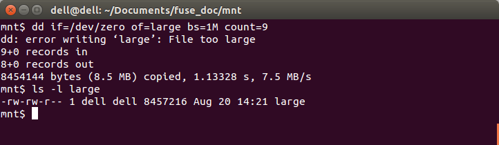
  + 创建一个已存在的文件 `./creat file_existed`;  
  
* 创建目录
  + 创建一个空目录 `mkdir emptydir`;  
  
  + 创建一个已存在的目录 `mkdir dir_existed`;  
  
* 删除文件
  + 删除一个已存在的文件 `rm file_existed`;  
  
  + 删除一个不存在的文件 `rm file_not_existed`;  
  
  + 删除一个已存在的目录文件 `rm dir_existed`;  
  
* 删除目录
  + 删除已存在的空目录 `rmdir dir_empty`;  
  
  + 删除已存在的非空目录 `rmdir dir_nonempty`;  
  
  + 删除不存在的目录 `rmdir dir_noexisted`;  
  
* 读文件
  + 读一个不存在的文件 `./read file_not_existed 0 1`;  
  
  + 从偏移位置 3 读 4 个字节 `./read file_existed 3 4`;  
  
  + 读一个目录文件 `./read dir_existed 0 1`;  
  
* 写文件
  + 在偏移位置 7 写 "wzh" `./write file_existed 7 wzh`;  
  
  + 写一个不存在的文件 `./write file_not_existed 0 string`;  
  
  + 写一个目录文件 ./write dir_existed 0 string`;  
  
  + 从文件的末尾写一个大小已达到上限的文件 `./write bigest 8457216 string`;  
  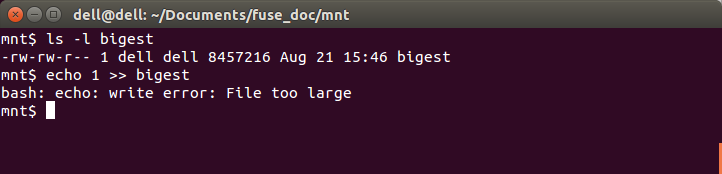
* 写目录
  + 在一个不存在的目录中创建新目录项 `mkdir dir_noexisted/dir`;  
  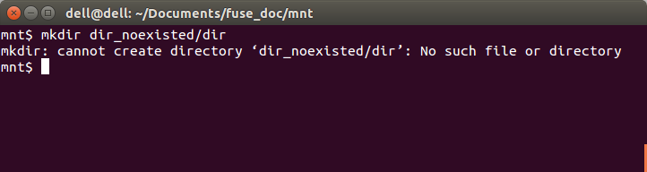
  + 在一个已存在的目录中创建新目录项 `mkdir dir_existed/dir`;  
  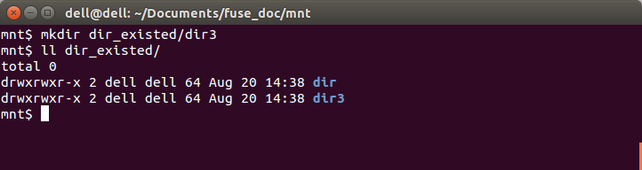
  + 耗尽某个目录可用的目录项, 一个目录可包含的目录项数上限为 `8259 * 1024 / 32 = 264288`,
    但用于测试的文件系统 i 结点数只有 8192 个, 故只能通过硬链接来测试, 但本文件系统目前还
    不支持硬链接, 故无法测试;  
* 重命名
  + 源文件不存在 `./mv file_not_existed file`;  
  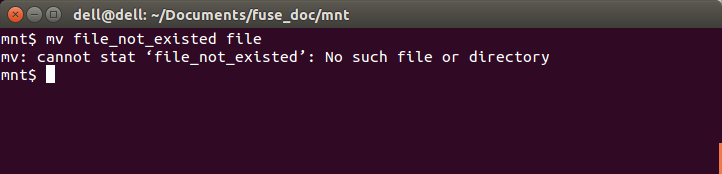
  + 源文件是文件, 目标不存在 `./mv file_existed file_not_existed`;  
  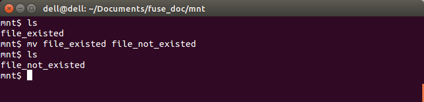
  + 源文件是目录, 目标不存在 `./mv dir_existed dir_noexisted`;  
  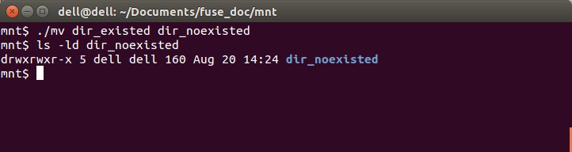
  + 源文件是文件, 目标是目录 `./mv file_existed dir_existed`;  
  
  + 源文件是目录, 目标是文件 `./mv dir_existed file_existed`;  
  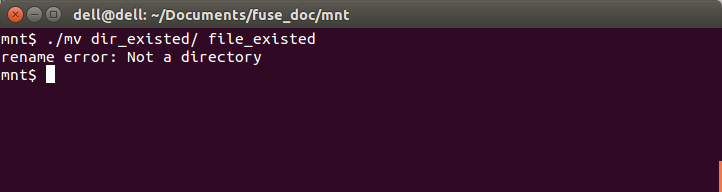
  + 源文件是目录, 目标是空目录 `./mv dir_existed dir_empty`;  
  
  + 源文件是目录, 目标是非空目录 `./mv dir_existed dir_nonempty`;  
  
  + 源文件是目录, 目标是源目录的子目录
    `./mv dir_existed dir_existed/sub`;  
  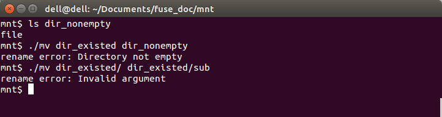

* 极端条件测试
  + 创建一个名字过长的文件 `./creat llllllllllllllllllllllllllll`;
  
  + 耗尽所有的 i 结点 (根结点事先占用一个 i 结点):  
  
		# exhausted.sh
		for ((i = 0; i < 8190; i++))
		do
			./creat mnt/file$i
		done
  回忆 "测试环境" 一节说过的话, 虽然磁盘中共了 8192 个 i 结点, 但是 i 结点 
  位图只能管理 8191 个, 虽然磁盘上还剩余一个 i 结点, 但是由于没有
  多余的位图空间, 因此系统也无法使用最后一个 i 结点.

  + 耗尽所有的逻辑块  
  
		# exhausted.sh
		dd if=/dev/zero of=mnt/file1 bs=1024 count=8259
		dd if=/dev/zero of=mnt/file2 bs=1024 count=8259
		dd if=/dev/zero of=mnt/file3 bs=1024 count=8259
		dd if=/dev/zero of=mnt/file4 bs=1024 count=8259

