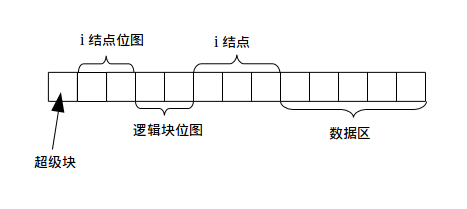
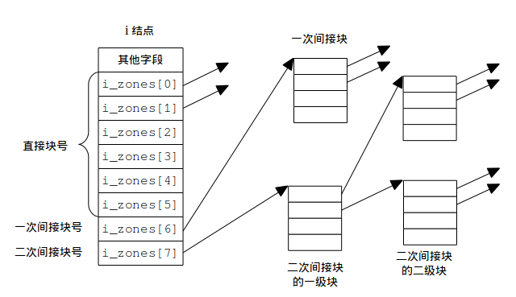
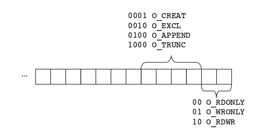

# 文件系统存储与组织详细设计

## 1.1 文件系统在磁盘上的布局

  
图 1-1 文件系统各个功能区在磁盘上的布局

## 1.2 常量说明

	#define UFS_MAGIC	0x7594	/* 文件系统的标识 */
	#define UFS_NAME_LEN    27	/* 文件名的最大长度, 不包括结尾的空字符 */
	#define UFS_PATH_LEN	1024	/* 路径名最大长度, 不包括结尾的空字符 */
	#define UFS_BLK_SIZE    512	/* 磁盘块大小 */
	#define UFS_OPEN_MAX    64	/* 同时打开文件数最大值 */
	#define UFS_DISK_MAX_SIZE   32	/* 磁盘文件最大值 (MB) */
	#define UFS_DISK_MIN_SIZE   1	/* 磁盘文件最小值 (MB) */
	#define UFS_ROOT_INO	1	/* 根目录的 i 结点号 */

## 1.3 主要数据结构

### 1.3.1 定义

* 逻辑块: 文件系统看待磁盘的方式, 文件系统分配磁盘的最小单位,
1 个逻辑块等于 1 个磁盘块的大小. 逻辑块编号从 1 开始.
* 磁盘块: 访问磁盘的最小单位, 编号从 0 开始, 每一个磁盘块大小为 512 字节.
* 数据块: 单个文件内部数据组成的块, 大小与逻辑块相同, 从 0 开始编号,
数据块号仅在包含它的文件内部有效.

在外部表现上, 逻辑块与磁盘块唯一的不同在于在磁盘上的起始位置不同. 磁盘块从磁盘的第
1 块 512
字节块 就开始, 一直到磁盘的最后一块 512 字节块. 而逻辑块的第 1 块从磁盘的数据区
开始, 该磁盘块前面的几块要预留给超级块, i 结点位图, 逻辑块位图,
与 i 结点使用, 逻辑块从它们之后的第 1 块开始, 从 1 开始编号. 在图 1-1 中, 从左到右,
磁盘块从第 1 块方格开始, 而逻辑块从第 9 块方格开始. 数据块指的是分配给文件, 用来
存储文件数据 (非元数据) 的逻辑块, 如果一个文件的大小为 678 KB,
那么它就拥有 2 块数据块, 数据块号按出现顺序依次为 1, 2.

### 1.3.2 文件系统超级块
超级块含有整个文件系统的配置信息

	/*
	 * super block in disk.
	 * sizeof(struct ufs_dsuper_block) <= 512
	 */
	struct ufs_dsuper_block {
		unsigned short s_magic; /* 文件系统魔数 */
		unsigned int s_imap_blocks;	/* i 结点位图所占块数, 以逻辑块计 */
		unsigned int s_zmap_blocks;	/* 逻辑块位图所占块数, 以逻辑块计 */
		unsigned int s_inode_blocks; /* i 结点块数, 以逻辑块计 */
		unsigned int s_zone_blocks;	/* 逻辑块块数 */
		off_t	s_max_size;	/* 最大文件长度 */
	};
	
	/* super block in memeory */
	struct ufs_msuper_block {
                unsigned short s_magic; /* 文件系统魔数 */
		unsigned int s_imap_blocks;	/* i 结点位图所占块数, 以逻辑块计 */
		unsigned int s_zmap_blocks;	/* 逻辑块位图所占块数, 以逻辑块计 */
		unsigned int s_inode_blocks; /* i 结点块数, 以逻辑块计 */
		unsigned int s_zone_blocks;	/* 逻辑块块数 */
		off_t	s_max_size;	/* 最大文件长度 */

		/* 下面的字段仅存在于内存中 */
		char *s_imap;		/* i 结点位图 */
		char *s_zmap;		/* 逻辑块位图 */
		unsigned int s_1st_inode_block; /* 第 1 块 i 结点块的磁盘块号 */
		unsigned int s_1st_zone_block; /* 第 1 块逻辑块的磁盘块号 */
		unsigned int	s_inode_left;	/* 剩余 i 结点数 */
		unsigned int s_block_left;	/* 剩余 逻辑块数 */
		int	s_fd;		/* 磁盘文件描述符 */
		void	*s_addr;	/* 磁盘文件在内存中的地址 */
	};

磁盘上的超级块大小要小于 512 字节, 这是因为超级块要完全放入磁盘的第一个磁盘块中.
`s_magic` 用于唯一地识别一个文件系统, 从磁盘上加载了超级块结构后, 如果魔
数正确, 那么就可以断定这是我们想要的文件系统. `s_max_size` 依赖于 i 结点所 
能支持的逻辑块块号数组大小, 以及逻辑块块大小, 在讲解 i 结点时会提到.
`s_zmap_blocks` 决定了文件系统所能支持的最大磁盘大小. 假设 `s_zmap_blocks` 为2,
且 逻辑块大小 为 512 字节, 那么文件系统最多支持 `2 * 512 * 8 * 512 = 4 MB` 大小 
的磁盘. i 结点位图的一个二进制位为 0,
表示相应的 i 结点位空闲; 为 1 则表示相应的 i 结点被占用. "i 结点号" 其实就
是 i 结点相应的位在位图中的下标. 逻辑块位图除了每一个位表示一个逻辑块外,
其他的与 i 结点位图相同.

`s_imap_blocks`, `s_zmap_blocks`, `s_inode_blocks` 与 `s_zone_blocks`
这四个字段需要根据磁盘文件大小动态计算. 本文件系统支持的磁盘大小在 1 MB 到 32 MB 之间,
将该区间分成三个子区间, 对每个子区间的分配策略如下  
* `1 <= size_in_MB <= 10`
  + `s_imap_blocks = 1`;
  + `s_zmap_blocks = 5`;
  + `s_inode_blocks = 256`;
* `10 < size_in_MB < 21`
  + `s_imap_blocks = 1`;
  + `s_zmap_blocks = 11`;
  + `s_inode_blocks = 512`;
* `21 <= size_in_MB <= 32`
  + `s_imap_blocks = 2`;
  + `s_zmap_blocks = 16`;
  + `s_inode_blocks = 1024`;

一旦确定了前三个字段, 最后一个字段 `s_zone_blocks` 便很容易计算得到.

之所以分成 "磁盘上的超级块" 与 "内存中的超级块" 是为了兼顾使用的方便与信息的最
小化. `struct ufs_msuper_block` 结构中多出来的信息可以通过 "磁盘上的超级块" 计算得到,
但如果每次使用时都重新计算比较浪费时间, 所以将这些辅助信息事先计算并存储起来.

为了分辨出 "所有 i 结点都被占用" 与 "所有逻辑块都被占用" 的情况, i 结点位图与
逻辑块位图的第 1 个位不用, 这样就可以通过返回 0 来表示无空闲 i 结点或 
逻辑块, 在初始化文件系统时, 这两位被初始化为 1.

### 1.3.3 i 结点

	/*
	 * 磁盘上的 i 结点.
	 * sizeof(struct ufs_dinode) <= UFS_BLK_SIZE
	 */
	struct ufs_dinode {
		nlink_t	i_nlink;	/* 链接数 */
		mode_t	i_mode;		/* 文件类型和访问权限 */
		off_t	i_size;		/* 文件长度, 以字节计 */
		time_t	i_mtime;	/* 文件内容最后一次被修改的时间 */
		time_t	i_ctime;	/* i 结点最后一次被修改的时间 */
		uid_t	i_uid;		/* 拥有此文件的用户 id */
		gid_t	i_gid;		/* 拥有此文件的用户的组 id */
		/*
		 * 文件内容用到的逻辑块块号数组.
		 *
		 * 0-5: 直接块;
		 * 6: 一次间接块
		 * 7: 二次间接块
		 */
		unsigned int i_zones[8];
	};

	/* 内存中的 i 结点. */
	struct ufs_minode {
		nlink_t	i_nlink;	/* 链接数 */
		mode_t	i_mode;		/* 文件类型和访问权限 */
		off_t	i_size;		/* 文件长度, 以字节计 */
		time_t	i_mtime;	/* 文件内容最后一次被修改的时间 */
		time_t	i_ctime;	/* i 结点最后一次被修改的时间 */
		uid_t	i_uid;		/* 拥有此文件的用户 id */
		gid_t	i_gid;		/* 拥有此文件的用户的组 id */
		/*
		 * 文件内容用到的逻辑块块号数组.
		 *
		 * 0-5: 直接块;
		 * 6: 间接块
		 * 7: 间间接块
		 */
		unsigned int i_zones[8];

		/* 下面的字段仅存在于内存中 */
		unsigned int	i_ino;		/* i 结点号, 从 1 开始, 等价于与该 i 结点对应的二进制位在 i 结点位图中的下标 */
		int	i_refcnt;	/* i 结点被引用的次数 */
	};

`i_nlink` 是指向该 i 结点的目录项的个数, 可用于实现硬链接. `i_mode` 包含了有关文件属性与
权限的信息, 该字段包含的信息如下图

  
图 1-2 `i_mode` 字段中每一位的作用.

`i_mode` 的高位在左, 低位在右. 低 9 位用于判断三类用户对该文件的读写权限,
位 9 用于判断文件类型, 其余位不用.

  
图 1-3 i 结点逻辑块块号数组的功能

如果存放逻辑块号的存储单元的值为 0, 说明该单元空闲.
很容易可以算出一个本文件系统在 32 位平台上所能支持的最大文件为
`(6 + 512/4 + (512/4) * (512/4)) * 512 = 8259 kB`. `struct ufs_minode`
结构中多出来的信息一方面是为了避免重复计算, 另一方面是为完成某些功能, 例如当 i 结点 
的链接数为 0 且引用次数为 0 时, 才可删除文件并回收资源, "引用次数" 指的是
打开文件表 `ufs_open_files` 中指向该 i 结点的项数.

### 1.3.4 目录项

	/* sizeof(struct ufs_dir_entry) <= UFS_BLK_SIZE */
	struct ufs_dir_entry {
		unsigned int	de_inum;		/* 文件的 i 结点号 */
		char	de_name[UFS_NAME_LEN + 1];	/* 文件名, 以空字符结尾 */
	};

每个目录至少含有 2 个目录项: `.` 与 `..`, 文件系统格式化后只含有一个根目录,
且只有 `.` 与 `..` 这两个目录项.

### 1.3.5 打开文件表

	struct file {
		struct ufs_minode f_inode;		/* 与该文件对应的 i 结点 */
		mode_t	f_mode;			/* 文件类型与访问权限 */
		int	f_flag;			/* 文件打开和控制标志 */
		int	f_count;		/* 对应文件句柄引用次数 */
		off_t	f_pos;			/* 当前文件偏移量 */
	};
	
	struct file ufs_open_files[UFS_OPEN_MAX]; /* 打开文件表 */

`ufs_open_files` 是文件系统存储打开文件信息的表格, 打开文件在表格中的索引将作
为文件描述符使用. `f_mode` 字段的含义与 i 结点的 `i_mode` 字段相同. 
`f_flag` 的标志包括:  
* 文件访问模式:
  + `O_RDONLY`: 只读打开
  + `O_WRONLY`: 只写打开
  + `O_RDWR`: 读写打开
* 文件创建与控制标志:
  + `O_APPEND`: 追加写;
  + `O_TRUNC`: 若打开方式包含写, 则截断文件;

  
图 1-4 `f_mode` 字段各位的作用, 高位在左, 低位在右.

3 种文件访问模式必须指定且只能指定一种, 但是文件创建与控制标志都是
可选的.

`f_count` 表示该文件被多少个描述符引用, 例如 `dup()` 函数就可以增加
`f_count` 的值, 当 `f_count` 为 0 时, 该文件从打开文件表中清除, 并
将该项置为空闲状态, 表项是否空闲的依据是 `f_count` 是否为 0.

## 1.4 功能函数 (或命令)

### `format` _`diskfile`_
* 功能: 格式化一个文件系统
* 命令行参数:
  + 磁盘文件路径, 在挂载文件系统之后, 磁盘文件必须存放在另一个
  文件系统上, 否则行为是未定义的.
* 程序执行结果: 由参数指定的文件被格式化成一个文件系统, 将作为磁盘
使用.
* 注: 本文提到的磁盘都是指利用普通文件模拟的磁盘, "普通文件" 来源于外部
文件系统 (例如 Ext4), 磁盘作为文件系统的私有数据使用. 一个文件或作为
磁盘使用的条件是: 
  + 大小在 1 MB 到 `UFS_DISK_MAX_SIZE` MB 之间
  + 是普通文件
  + 用户可读写

### `int ufs_read_sb(const char *diskname)`
* 功能: 从磁盘上读超级块
* 输入参数:
  + `diskname`: 磁盘文件名
* 返回值: 成功返回 磁盘文件描述符; 失败返回 -1
* 注: 超级块作为文件系统的私有数据使用, 所以未在函数签名中显式给出. 
磁盘文件必须曾被 `format` 程序格式化过.

### `unsigned int ufs_new_inode(void)`
* 功能: 获取一个空闲的 i 结点
* 返回值: 若找到一个空闲的 i 结点, 返回它的 i 结点号; 否则返回 0
* 注: i 结点号从 1 开始

### `int ufs_free_inode(unsigned int inum)`
* 功能: 释放一个指定的 i 结点
* 输入参数:
  + `inum`: 将被释放的 i 结点的编号
* 返回值: 若成功返回 0; 若失败返回对应的 `errno` . 以下情况返回失败:
  + i 节点号超出范围 返回 `-EINVAL`;
  + i 节点原来就处理空闲状态, 返回  `-EAGAIN`;

### `int ufs_rd_inode(unsigned int inum, struct ufs_dinode *inode)`
* 功能: 读取指定的 i 结点
* 输入参数:
  + `inum`: 被读取的 i 结点的编号
  + `inode`: 存放 i 结点的缓冲区
* 返回值: 若成功返回 0; 失败返回对应的 `errno`. 以下情况返回失败:
  + i 节点号超出范围, 返回 `-EINVAL`
  + `inode` 为空, 返回 `-EINVAL`;
  + 被调用函数返回错误值, 将错误值原样返回.

### `int ufs_wr_inode(struct ufs_minode *inode)`
* 功能: 将指定的 i 结点写回磁盘
* 输入参数:
  + `inode`: 需写回磁盘的 i 结点
* 返回值: 若成功返回 0; 若失败返回 对应的 `errno`. 错误情况包括:
  + `-EINVAL`: 输入参数不合法, 包括 `inode` 为空, i 结点号无效;
  + 被调用函数返回出错, 将错误值原样返回.

### `unsigned int ufs_new_zone(void)`
* 功能: 获取一块空闲的逻辑块
* 返回值: 若找到一块空闲的逻辑块, 返回它的逻辑块号; 否则返回 0
* 注: 逻辑块用于存储文件数据 (不包括元数据), 是针对于文件系统的; 而磁盘上
的每 512 字节为一个磁盘块, 磁盘块中可以存储任意的内容 (无论是 i 结点, 还是
文件数据)

### `int ufs_free_zone(unsigned int zone_num)`
* 功能: 释放一个指定的逻辑块
* 输入参数: 
  + `zone_num`: 将被释放的逻辑块块号
* 返回值: 成功时返回 0; 若失败返回 `errno`. 以下情况返回失败:
  + `zone_num` 超出范围, 返回 `-EINVAL`;
  + `zone_num` 原来就处于已释放状态, 返回 `-EAGAIN`;

### `int ufs_rd_zone(unsigned int zone_num, void *buf, size_t size)`
* 功能: 读一个指定的逻辑块
* 输入参数: 
  + `zone_num` :将被读取的逻辑块块号
  + `buf`: 存储逻辑块数据的缓冲区
  + `size`: 缓冲区大小, 必须等于逻辑块大小
* 返回值: 若成功, 返回0; 若失败, 返回 `errno`. 以下情况返回失败:
  + `zone_num` 超出范围, 返回  `-EINVAL`;
  + `buf` 为空, 返回 `-EINVAL`;
  + `size` 不等于 逻辑块大小, 返回 `-EINVAL`;
  + 被调用函数返回出错, 将错误值原样返回.

### `int ufs_wr_zone(unsigned int zone_num, void *buf, size_t size)`
* 功能: 将一个指定的逻辑块写入磁盘
* 输入参数:
  + `zone_num`: 逻辑块块号
  + `buf`:写入逻辑块的缓冲区
  + `size`: 缓冲区大小, 必须等于逻辑块大小
* 返回值: 成功返回 0; 失败返回 `errno`. 以下情况返回失败:
  + `zone_num` 超出范围, 返回 `-EINVAL`;
  + `buf` 为空, 返回 `-EINVAL`;
  + `size` 不等于 逻辑块大小, 返回 `-EINVAL`;
  + 被调用函数返回出错, 将错误值原样返回.

### `unsigned int inum2bnum(unsigned int inum)`
* 功能: 计算指定的 i 结点所在的磁盘块块号
* 输入参数:
  + `inum`: 待计算的 i 结点号
* 返回值: 编号为 `inum` 的 i 结点所在的磁盘块块号. 若 `inum` 无效,
返回 0.
* 注: 磁盘的第一个块被超级块占用, 故 0 号磁盘块不会被用到, 可用
作错误的返回值.

### `unsigned int znum2bnum(unsigned int zone_num)`
* 功能: 计算指定的逻辑块所在的磁盘块块号
* 输入参数:
  + `zone_num`: 待计算的逻辑块块号
* 返回值: 编号为 `zone_num` 的逻辑块所在的磁盘块块号. 若 `zone_num`
无效则返回 0.

### `unsigned int dnum2znum(struct ufs_minode *inode, unsigned int data_num)`
* 功能: 计算指定的数据块所在的逻辑块号
* 输入参数:
  + `inode`: 数据块所在的 i 结点指针.
  + `data_num`: 数据块号
* 返回值: 若数据块号与 i 结点有效, 且数据块存在, 返回对应的逻辑块号; 否则返回 0.
* 注: "数据块" 是相对于单个文件的, 从 1 开始编号, 数据块号最大值
受限于 i 结点所能支持的最大文件大小.

### `unsigned int ufs_creat_zone(struct ufs_minode *inode, unsigned int data_num)`
* 功能: 计算指定的数据块所在的逻辑块号, 若不存在则创建一块;
* 输入参数:
  + `inode`: 数据块所在的 i 结点指针;
  + `data_num`: 数据块块号;
* 返回值: 若数据块号与 i 结点有效, 文件大小未达到上限且磁盘有空闲逻辑块,
则返回对应的逻辑块号; 否则返回 0.

### `int ufs_rd_blk(unsigned int blk_num, void *buf, size_t size)`
* 功能: 从磁盘上读一块指定的磁盘块
* 输入参数:
  + `blk_num`: 将被读的磁盘块块号
  + `buf`: 存储磁盘块的缓冲区
  + `size`: 缓冲区大小, 必须等于磁盘块大小
* 返回值: 若成功返回 0; 失败返回 `errno`. 以下情况返回失败:
  + `blk_num` 无效, 返回 `-EINVAL`;
  + `buf` 为空, 返回 `-EINVAL`;
  + `size` 不等于磁盘块大小, 返回 `-EINVAL`;
  + 被调用函数返回出错, 将错误值原样返回.
* 注: 磁盘文件上的每 512 字节都算作一个磁盘块, 而不管该磁盘块存放的是什么
内容, 下同.

### `int ufs_wr_blk(unsigned int blk_num, void *buf, size_t size)`
* 功能: 写一块指定的磁盘块
* 输入参数:
  + `blk_num`: 将被写入的磁盘块的块号
  + `buf`: 写入磁盘块的缓冲区
  + `size`: 缓冲区大小, 必须等于磁盘块大小
* 返回值: 若成功返回 0; 失败返回 -1, 以下情况返回失败:
  + `blk_num` 无效, 返回 `-EINVAL`;
  + `buf` 为空, 返回 `-EINVAL`;
  + `size` 不等于磁盘块大小, 返回 `-EINVAL`;
  + 被调用函数返回出错, 将错误值原样返回.

### `int ufs_path2i(const char *path, struct ufs_minode *inode)`
* 功能: 将路径名映射为 i 结点
* 输入参数:
  + `path`: 被映射的路径名;
  + `inode`: 存放映射后的 i 结点;
* 返回值: 成功返回 0, 失败返回 `errno`, 失败包括:
  + `path` 为空或过长, 返回 `-EINVAL`;
  + `inode` 为空, 返回 `-EINVAL`;
  + 被调用函数返回出错, 将错误值原样返回.

### `int ufs_dir2i(const char *dirpath, struct ufs_minode *dirinode)`
* 功能: 将目录的路径名映射为对应的 i 结点;
* 输入参数: 
  + `dirpath`: 目录的路径名;
  + `dirinode`: 存放映射后的 i 结点;
* 返回值: 成功返回 0, 失败返回 `errno`, 错误情况包括
  + 路径引用的文件不是一个目录文件, 返回 `-ENOTDIR`;
  + 被调用函数返回出错, 将错误值原样返回.

### `int ufs_find_entry(struct ufs_minode *parent, const char *filename, struct ufs_dir_entry *ent)`
* 功能: 在指定的目录中查找具有指定文件名的文件
* 输入参数:
  + `parent`: 查找的位置, 必须是目录;
  + `filename`: 待查找的文件名;
  + `ent`: 若查找成功, 存放被查找文件的目录项
* 返回值: 查找成功返回 0; 失败返回 `errno`, 失败包括:
  + 任一输入参数为空或无效, 返回 `-EINVAL`;
  + `parent` 不是一个目录, 返回 `-ENOTDIR`;
  + 未找到与 `filename` 对应 的目录项, 返回 `-ENOENT`;
  + 被调用函数返回出错, 将错误值原样返回.

### `int ufs_rm_entry(struct ufs_minode *dir, const struct ufs_dir_entry *entry)`
* 功能: 从指定的目录中移除一指定的目录项;
* 输入参数:
  + `dir`: 在该目录中移除一个目录项;
  + `entry`: 被移除的目录项;
* 返回值: 移除成功返回 0; 失败返回 `errno`. 在以下情况返回失败:
  + 任一参数为空, 返回 `-EINVAL`;
  + `dir` 不是一个目录, 返回 `-ENOTDIR`;
  + 目录中不存在被移除的目录项, 返回 `-ENOENT`;
  + 目录大小与数据块数不匹配, 返回 `-EIO`;
  + 被调用函数返回出错, 将错误值原样返回.

### `int ufs_add_entry(struct ufs_minode *dir, const struct ufs_dir_entry *entry)`
* 功能: 在指定的目录中新增一个目录项
* 输入参数:
  + `dir`: 在该目录中新增一个目录项;
  + `entry`: 新增的目录项
* 返回值: 添加成功返回 0; 失败返回 `errno`. 在以下情况返回失败：
  + 任一参数为空, 返回 `-EINVAL`;
  + `dir` 不是一个目录, 返回 `-ENOTDIR`;
  + 没有磁盘空间存放目录项, 返回 `-ENOSPC`;
  + 被调用函数返回出错, 将错误值原样返回.

### `int ufs_truncate(struct ufs_minode *iptr)`
* 功能: 释放 i 结点占用的所有数据块
* 输入参数:
  + `iptr`: 将被截断的 i 结点指针;
* 返回值:
  + 成功返回 0; 失败返回 `errno`. 在以下情况返回失败:
  + `iptr` 为空返回 `-EINVAL`;
  + 被调用函数返回出错, 将错误值原样返回.

### `int ufs_is_empty(struct ufs_minode *inode)`
* 功能: 判断目录是否为空 (即只包含 `.` 与 `..` 这两个目录项);
* 输入参数:
  + `inode`: 目录的 i 结点;
* 返回值: 若 目录只包含 `.` 与 `..` 这两个目录项, 返回 1; 以下情况返回 0:
  - `inode` 为空;
  - `inode` 不是一个目录文件;
  - `inode` 包含除了 `.` 与 `..` 之外的目录项;

## 1.5 功能函数详细流程
